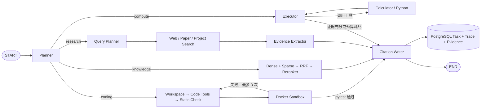

# AutoScholar

> 面向 AI/ML 研究与实验的自主智能体平台  
> Autonomous AI/ML Research & Experiment Agent Platform

AutoScholar 的目标是把复杂研究目标转化为可追踪、可恢复、可评测、可复现的研究流程。当前支持 Web/论文研究、项目知识库、隔离代码执行与 MNIST 实验；Phase 6 新增带预算和版本历史的自主规划、审查与重规划闭环。

## 当前能力

- FastAPI 服务、结构化日志、请求 ID 与统一错误响应
- PostgreSQL、Redis、Docker Compose 与 Alembic 自动迁移
- OpenAI-compatible `LLMProvider`，支持原生 Function Calling
- LangGraph 最小闭环：`Planner → Executor ⇄ Tools → Writer`
- Calculator 安全算术表达式工具
- 受限 Python 子进程工具
- Tavily Web Search 与 Semantic Scholar Paper Search
- Query Planner、Evidence Extractor 与 Citation Writer
- PDF 上传、文本解析、结构感知分块与可恢复后台摄取任务
- Qdrant Dense + BM25 Sparse 检索、RRF 融合与 BGE Reranker
- 独立 RAG Query API 与 Agent `knowledge` 模式
- 本地文档、Web 和论文来源统一进入 Evidence Pool
- Recall@K、HitRate@K、MRR、NDCG RAG Benchmark
- Evidence、Claim-Citation 映射和降级警告持久化
- Agent 任务和 Tool Trace 持久化
- Coding Agent：生成、搜索、读取、原子修改和删除任务源码
- 静态检查、pytest、结构化错误分类和最多 3 次自动修复
- 断网、非 root、限制 CPU/内存/PID/时长的一次性 Docker 沙箱
- 真实 MNIST 只读数据卷与 CPU PyTorch 运行环境
- 同步执行 API 与任务回查 API

当前 PDF 管线只处理可提取文本的 PDF，不执行 OCR；扫描件和加密 PDF 会明确失败。Web/论文检索仍只使用搜索片段与论文摘要，不自动下载外部全文。

## 工作流



默认预算：最多 6 次执行迭代、4 次工具调用、8 个计划步骤。预算耗尽时，任务状态为 `budget_exceeded`，Writer 会利用已有证据给出带限制说明的部分答案。

## 快速开始

### 环境要求

- Python 3.12
- [`uv`](https://docs.astral.sh/uv/)
- Docker Desktop（包含 Docker Compose）

当前 Windows 开发环境把 Docker Desktop 安装在 `D:\Applications\Docker`，运行数据保存在 `D:\DockerData\wsl`，避免镜像和卷占用系统盘。其他环境可自行选择安装位置。

### 配置模型

```powershell
Copy-Item .env.example .env
```

在本地 `.env` 中填写 OpenAI-compatible 服务：

```dotenv
LLM_BASE_URL=https://your-provider.example/v1
LLM_API_KEY=your-api-key
LLM_MODEL=your-model

TAVILY_API_KEY=your-tavily-api-key
# 可选但推荐；匿名 Semantic Scholar API 也可使用
SEMANTIC_SCHOLAR_API_KEY=your-semantic-scholar-api-key
```

Agent 只使用原生 Function Calling，不提供 JSON Prompt 降级方案。模型至少需要支持 `tools` 和 `tool_choice=auto`；若未返回要求的原生工具调用，任务会明确失败并持久化错误。`.env` 已被 Git 忽略，禁止把任何密钥提交到仓库或粘贴到日志、Issue。

### 使用 Docker 启动

```powershell
docker compose up -d --build
docker compose ps -a
```

`migrate` 服务会先执行 `alembic upgrade head`，成功后 API 才会启动。API 默认地址为 `http://localhost:8000`，交互式文档位于 `http://localhost:8000/docs`。

停止服务：

```powershell
docker compose down
```

命名卷会保留 PostgreSQL、Redis、Qdrant、PDF 原文件和本地模型缓存。除非确认需要清空全部数据，否则不要执行 `docker compose down -v`。

首次使用 Coding Agent 前，需要联网准备一次真实 MNIST 数据；之后任务沙箱始终断网运行：

```powershell
docker compose build sandbox-image
docker compose --profile datasets run --rm mnist-init
docker compose up -d --build
```

该操作只写入 `autoscholar_mnist_data` Docker 卷，不会把数据写入 Git。

### 本地开发

```powershell
uv sync --all-groups
uv run alembic upgrade head
uv run uvicorn autoscholar.main:app --reload
```

## API

| 方法 | 路径 | 说明 |
|---|---|---|
| `GET` | `/health/live` | API 进程存活检查 |
| `GET` | `/health/ready` | PostgreSQL、Redis 和 LLM 配置状态 |
| `POST` | `/chat` | 无状态单轮模型调用 |
| `POST` | `/agent/run` | 同步运行最小 Agent 闭环 |
| `GET` | `/agent/tasks/{task_id}` | 回查任务、指标和 Tool Trace |
| `GET` | `/agent/tasks/{task_id}/evidence` | 分页查询结构化 Evidence |
| `GET` | `/agent/tasks/{task_id}/workspace` | 查询 Coding 任务工作区清单和校验值 |
| `GET` | `/agent/tasks/{task_id}/workspace/files/{path}` | 读取工作区 UTF-8 文本文件 |
| `POST` | `/projects` | 创建隔离的知识库项目 |
| `GET` | `/projects`、`/projects/{project_id}` | 列出或读取项目 |
| `POST` | `/projects/{project_id}/documents` | 上传 PDF 并进入后台摄取队列 |
| `GET` | `/projects/{project_id}/documents` | 查询 PDF 处理状态 |
| `GET` | `/projects/{project_id}/documents/{document_id}/content` | 受控读取 PDF 原文件 |
| `POST` | `/projects/{project_id}/documents/{document_id}/retry` | 重试失败的 PDF |
| `POST` | `/projects/{project_id}/documents/{document_id}/reindex` | 重新解析和索引 PDF |
| `DELETE` | `/projects/{project_id}/documents/{document_id}` | 异步删除原文件、元数据和向量 |
| `POST` | `/projects/{project_id}/rag/query` | 查询项目知识库并返回页码证据 |

运行 Agent：

```powershell
$body = @{
  objective = "调研 LoRA、QLoRA 和 DoRA 的核心区别"
  mode = "research"
} | ConvertTo-Json -Compress

$bytes = [System.Text.Encoding]::UTF8.GetBytes($body)

$result = Invoke-RestMethod `
  -Method Post `
  -Uri "http://127.0.0.1:8000/agent/run" `
  -ContentType "application/json; charset=utf-8" `
  -Body $bytes `
  -TimeoutSec 180

$result | ConvertTo-Json -Depth 10
```

回查已持久化任务：

```powershell
Invoke-RestMethod `
  -Uri "http://127.0.0.1:8000/agent/tasks/$($result.task_id)" |
  ConvertTo-Json -Depth 10
```

查询 Evidence：

```powershell
Invoke-RestMethod `
  -Uri "http://127.0.0.1:8000/agent/tasks/$($result.task_id)/evidence?limit=50&offset=0" |
  ConvertTo-Json -Depth 10
```

`mode` 支持 `auto`、`research`、`compute`、`knowledge` 和 `coding`，默认 `auto`。`knowledge` 必须携带 `project_id`；可用 `document_ids` 进一步缩小范围。`research` 携带 `project_id` 时会混合本地文档和外部证据；`research_sources` 可选择 `web`、`paper` 或两者，默认 `@("web", "paper")`。`coding` 在任务专属工作区内创建项目，只有静态检查和 pytest 都通过才会返回 `succeeded`。失败响应也会携带 `task_id`，可回查持久化错误和 Tool Trace。

## 受限 Python 的边界

Python 工具会先做 AST 白名单检查，再使用 `python -I -S`、空临时目录和最小环境启动独立子进程。当前限制包括：

- 代码最多 4,000 字符
- 执行超时 3 秒
- 输出最多 16,000 字符
- 禁止 import、文件、网络、进程、属性访问、函数/类定义、异常结构和 `while`

这是 Phase 1 的轻量计算器，不适合运行生成项目。Phase 4 Coding Agent 使用单独的 Docker 沙箱：API 不直接持有 Docker Socket；内部管理服务为每次运行创建一次性、断网、非 root 容器，而且不会向容器传递 AutoScholar 的 `.env` 或外部服务密钥。

## 测试

```powershell
uv run ruff check src tests migrations
uv run mypy
uv run pytest
```

Compose 服务健康后运行真实基础设施测试：

```powershell
$env:AUTOSCHOLAR_RUN_INTEGRATION="1"
uv run pytest tests/integration -m integration
```

### Phase 2 验收要点

使用上面的 LoRA/QLoRA/DoRA 请求完成真实验收后，确认：

- `status` 为 `succeeded`；如果某个外部服务失败，则应为 `partial` 而不是伪造完整结果
- `tool_calls` 同时包含 `web_search` 和 `paper_search`
- LoRA、QLoRA、DoRA 各有来自原始论文的 Evidence
- `answer` 中的 `[E#]` 都能在 `evidence` 和独立 Evidence 接口中找到
- `citations` 中每个主要 Claim 都至少绑定一个 Evidence ID
- API 重启后仍能通过 `task_id` 查到 Answer、Trace、Evidence 和 Citation

自动化测试使用 Mock Provider，不消耗 Tavily 或 Semantic Scholar API 配额。真实验收需要在本地 `.env` 配置 Tavily Key；Semantic Scholar 匿名接口可能受共享限流影响，因此建议同时配置其 API Key。

### Phase 3 本地验收

以下命令适用于 Windows PowerShell。先启动 Compose，并确认 `api`、`worker`、`postgres`、`redis`、`qdrant` 为正常状态：

```powershell
docker compose up -d --build
docker compose ps -a
Invoke-RestMethod http://127.0.0.1:8000/health/ready |
  ConvertTo-Json -Depth 5
```

创建项目：

```powershell
$projectBody = @{ name = "Phase 3 验收"; description = "本地论文知识库" } |
  ConvertTo-Json -Compress
$project = Invoke-RestMethod `
  -Method Post `
  -Uri "http://127.0.0.1:8000/projects" `
  -ContentType "application/json; charset=utf-8" `
  -Body ([System.Text.Encoding]::UTF8.GetBytes($projectBody))
$projectId = $project.id
```

准备一个可复制文本的 PDF，把路径替换为你的实际文件。使用 `curl.exe` 可兼容 Windows PowerShell 5.1 的 multipart 上传：

```powershell
$pdfPath = "D:\papers\lora.pdf"
$uploadJson = curl.exe -sS -X POST `
  "http://127.0.0.1:8000/projects/$projectId/documents" `
  -F "file=@$pdfPath;type=application/pdf" `
  -F "title=LoRA Paper"
$document = $uploadJson | ConvertFrom-Json
$documentId = $document.id
```

后台 Worker 首次运行会下载 Dense 和 BM25 模型。轮询直到 `ready`；如果变为 `failed`，命令会输出错误码和错误信息：

```powershell
do {
  Start-Sleep -Seconds 2
  $document = Invoke-RestMethod `
    "http://127.0.0.1:8000/projects/$projectId/documents/$documentId"
  $document | Select-Object status,page_count,chunk_count,index_version,error_code,error_message
} while ($document.status -in @("queued", "processing"))

if ($document.status -ne "ready") { throw "PDF indexing failed: $($document.error_code)" }
```

执行默认的 Hybrid + Reranker 查询。首次查询还会下载 Reranker 模型，因此耗时会明显长于后续请求：

```powershell
$ragBody = @{
  question = "这篇论文提出了什么方法？请指出依据。"
  document_ids = @($documentId)
  retrieval_mode = "hybrid_rerank"
  top_k = 5
} | ConvertTo-Json -Depth 5 -Compress

$rag = Invoke-RestMethod `
  -Method Post `
  -Uri "http://127.0.0.1:8000/projects/$projectId/rag/query" `
  -ContentType "application/json; charset=utf-8" `
  -Body ([System.Text.Encoding]::UTF8.GetBytes($ragBody)) `
  -TimeoutSec 300

$rag.answer
$rag.evidence | Format-Table citation_key,title,page,section,relevance,document_id,chunk_id
$rag.citations | ConvertTo-Json -Depth 5
```

验收时确认：`evidence` 全部属于当前项目和选定文档；每项都有 `page`、原文 `excerpt` 与 `chunk_id`；回答里的 `[E#]` 都存在于 `evidence`，且 `citations` 的映射一致。还可以把 `retrieval_mode` 分别改为 `dense`、`sparse`、`hybrid` 做对照。

通过 Agent 验收 `knowledge` 路由：

```powershell
$agentBody = @{
  objective = "根据我上传的论文解释其核心方法"
  mode = "knowledge"
  project_id = $projectId
  document_ids = @($documentId)
  retrieval_mode = "hybrid_rerank"
} | ConvertTo-Json -Depth 5 -Compress

$agent = Invoke-RestMethod `
  -Method Post `
  -Uri "http://127.0.0.1:8000/agent/run" `
  -ContentType "application/json; charset=utf-8" `
  -Body ([System.Text.Encoding]::UTF8.GetBytes($agentBody)) `
  -TimeoutSec 300

$agent | ConvertTo-Json -Depth 10
Invoke-RestMethod "http://127.0.0.1:8000/agent/tasks/$($agent.task_id)" |
  ConvertTo-Json -Depth 10
```

使用 Tavily 验收本地与外部资料混合，同时避免 Semantic Scholar 匿名限流影响本阶段结果：

```powershell
$mixedBody = @{
  objective = "对照上传论文和 Web 资料，解释 LoRA 的参数效率、初始化和推理行为"
  mode = "research"
  project_id = $projectId
  document_ids = @($documentId)
  retrieval_mode = "hybrid_rerank"
  research_sources = @("web")
} | ConvertTo-Json -Depth 6 -Compress

$mixed = Invoke-RestMethod `
  -Method Post `
  -Uri "http://127.0.0.1:8000/agent/run" `
  -ContentType "application/json; charset=utf-8" `
  -Body ([System.Text.Encoding]::UTF8.GetBytes($mixedBody)) `
  -TimeoutSec 600

$mixed | ConvertTo-Json -Depth 10

if ($mixed.status -ne "succeeded") { throw "Mixed research failed: $($mixed.status)" }
if (-not ($mixed.tool_calls | Where-Object { $_.tool_name -eq "web_search" -and $_.status -eq "succeeded" })) {
  throw "Tavily web_search did not succeed"
}
if (-not ($mixed.tool_calls | Where-Object { $_.tool_name -eq "knowledge_search" -and $_.status -eq "succeeded" })) {
  throw "Local knowledge_search did not succeed"
}
if ($mixed.tool_calls | Where-Object { $_.tool_name -eq "paper_search" }) {
  throw "paper_search should not run when research_sources contains only web"
}
if (-not ($mixed.evidence | Where-Object { $_.provider -eq "tavily" -and $_.source_type -eq "web" })) {
  throw "Tavily Evidence is missing"
}
if (-not ($mixed.evidence | Where-Object {
  $_.provider -eq "qdrant" -and $_.source_type -eq "document" -and
  $_.document_id -eq $documentId -and $_.chunk_id -and $_.page
})) {
  throw "Project document Evidence is missing or out of scope"
}
```

验收结果必须同时包含 Tavily `web` 和 Qdrant `document` Evidence，且本地 Evidence 的 `excerpt` 是服务器保存的原始 PDF 分块，不依赖模型逐字符复写。若需要完整 Web + 论文研究，省略 `research_sources` 或指定 `@("web", "paper")`；此时 Semantic Scholar 失败会如实返回 `partial`。

RAG Benchmark 示例位于 `benchmarks/rag/example.jsonl`。把占位 ID 替换为人工标注的 `document_id`/`chunk_id` 后运行：

```powershell
uv run python -m autoscholar.evaluation.rag `
  --dataset benchmarks/rag/my-benchmark.jsonl `
  --project-id $projectId `
  --modes dense sparse hybrid hybrid_rerank `
  --ks 5 10
```

### Phase 4 本地验收

以下命令适用于当前 Windows 环境，并显式使用 D 盘安装的 Docker：

```powershell
$docker = "D:\Applications\Docker\resources\bin\docker.exe"
& $docker compose build sandbox-image
& $docker compose --profile datasets run --rm mnist-init
& $docker compose up -d --build
& $docker compose ps -a

$health = Invoke-RestMethod "http://127.0.0.1:8000/health/ready"
$health.capabilities | Format-List
if ($health.capabilities.sandbox.status -ne "ok") { throw "Sandbox is not ready" }
if ($health.capabilities.mnist_dataset.status -ne "ok") { throw "MNIST is not ready" }

& $docker compose exec -T sandbox-manager python -m autoscholar.sandbox.smoke
```

执行真实 Coding Agent 任务：

```powershell
$codingBody = @{
  objective = @"
在空工作区中创建一个小型、可测试的 PyTorch MNIST MLP 项目。
要求包含模型、训练入口和 pytest；使用 MNIST_ROOT 环境变量、download=False、固定随机种子，
测试真实 MNIST 的一个小批次，验证输出形状、有限损失以及反向传播后参数发生更新。
"@
  mode = "coding"
} | ConvertTo-Json -Compress

$coding = Invoke-RestMethod `
  -Method Post `
  -Uri "http://127.0.0.1:8000/agent/run" `
  -ContentType "application/json; charset=utf-8" `
  -Body ([System.Text.Encoding]::UTF8.GetBytes($codingBody)) `
  -TimeoutSec 1800

$coding | ConvertTo-Json -Depth 10
if ($coding.status -ne "succeeded") { throw "Coding task failed" }
if ($coding.mode -ne "coding") { throw "Coding mode was not used" }
if (-not ($coding.tool_calls | Where-Object { $_.tool_name -eq "static_check" -and $_.status -eq "succeeded" })) {
  throw "Static check did not pass"
}
if (-not ($coding.tool_calls | Where-Object { $_.tool_name -eq "run_pytest" -and $_.status -eq "succeeded" })) {
  throw "pytest did not pass"
}
```

查看生成文件、校验值和持久化执行日志：

```powershell
$workspace = Invoke-RestMethod `
  "http://127.0.0.1:8000/agent/tasks/$($coding.task_id)/workspace"
$workspace.files | Format-Table path,size_bytes,sha256

$sourcePath = ($workspace.files | Where-Object { $_.path -like "source/*.py" } |
  Select-Object -First 1).path
$encodedPath = ($sourcePath -split "/" | ForEach-Object {
  [System.Uri]::EscapeDataString($_)
}) -join "/"
Invoke-RestMethod `
  "http://127.0.0.1:8000/agent/tasks/$($coding.task_id)/workspace/files/$encodedPath" |
  Select-Object path,content
```

自动化验收中的故障脚本会先制造 `SyntaxError`，确认错误被分类后由 Agent 修改文件并重新运行；因此不要求真实模型每次都故意产生错误。可单独执行：

```powershell
uv run pytest tests/test_coding_agent.py tests/test_coding_workspace.py tests/test_sandbox.py
```

Phase 4 验收标准是：工作区不能越界，沙箱看不到密钥且不能联网，超时会终止并清理容器，真实 MNIST 项目静态检查和 pytest 通过，强制故障用例至少完成一次修复。模型检查点、图表、实验指标和通用 Artifact 生命周期留到 Phase 5。

## Phase 5 本地验收

实验模式会在断网、只读根文件系统的 Docker 沙箱中，用固定种子的 MNIST 子集训练 MLP 与 CNN，并保存实测指标、曲线、模型 checkpoint 和报告。默认配置为每个模型训练 2 轮；最小验收可使用每模型 1 轮、128 条训练样本和 128 条测试样本。小样本结果仅用于工程验收，不代表完整 MNIST 基准性能。

首次使用前，先按上文准备 MNIST 数据集。启动服务后，可运行无需 LLM 密钥的真实训练验收：

```powershell
$docker = "D:\Applications\Docker\resources\bin\docker.exe"
& $docker compose up -d --build
& $docker compose exec -T api python -m autoscholar.experiment.smoke
```

成功时输出 `status: succeeded`、两种模型的实测准确率、数据集 SHA-256 和 `artifacts: 10`。该命令会在本地数据库和工作区留下一个验收任务。请勿将固定子集的单次结果解读为模型优劣结论。

对外开放实验 API 前，在本地 `.env` 中设置足够长的随机 `EXPERIMENT_API_TOKEN`，并重新创建 API 容器：

```powershell
& $docker compose up -d --force-recreate api
$token = Read-Host "EXPERIMENT_API_TOKEN"
$headers = @{ Authorization = "Bearer $token" }
$body = @{
  objective = "Compare MLP and CNN on MNIST"
  mode = "experiment"
  experiment_specification = @{
    epochs = 1
    train_samples = 128
    test_samples = 128
  }
} | ConvertTo-Json -Depth 5 -Compress
$result = Invoke-RestMethod -Method Post `
  -Uri "http://127.0.0.1:8000/agent/run" `
  -Headers $headers `
  -ContentType "application/json; charset=utf-8" `
  -Body ([System.Text.Encoding]::UTF8.GetBytes($body)) `
  -TimeoutSec 900
$result | ConvertTo-Json -Depth 10
```

实验 API 默认关闭；未配置 token 时返回 503，缺少或错误的 token 返回 401。`/agent/run` 的实验模式会调用已配置的 LLM 生成计划，内部 smoke 验收则不消耗 LLM 配额。查询、下载也必须带相同的 `$headers`：

```powershell
$taskId = $result.task_id
$experiments = Invoke-RestMethod -Headers $headers `
  "http://127.0.0.1:8000/agent/tasks/$taskId/experiments"
$artifacts = Invoke-RestMethod -Headers $headers `
  "http://127.0.0.1:8000/agent/tasks/$taskId/artifacts"
$artifacts.items | Format-Table id,path,size_bytes,sha256
$report = $artifacts.items | Where-Object path -eq "reports/report.md" | Select-Object -First 1
Invoke-WebRequest -Headers $headers `
  "http://127.0.0.1:8000/agent/tasks/$taskId/artifacts/$($report.id)" `
  -OutFile "data/phase5-report.md"
```

还可通过 `/agent/tasks/{task_id}` 查看状态与执行轨迹，通过 `/agent/tasks/{task_id}/experiments/{experiment_id}` 查看实验详情。实验产物按任务隔离、下载前校验 SHA-256；`.env`、设计文档、数据集和训练产物都不得提交到 Git。

## Phase 6 本地验收

显式使用 `mode: autonomous` 才会启动完整工作流；`auto` 不会升级到自主实验。入口、父任务、子任务、历史和产物均使用现有 `EXPERIMENT_API_TOKEN` 鉴权。执行范围仍为 CPU / MNIST / MLP 与 CNN 对比，不支持任意数据集或 GPU。

流程为结构化 DAG 计划 → 研究/代码/实验 → 规则与 LLM 双重审查 → 必要时重规划 → 报告。只有受影响的步骤及其下游会重跑；每轮子任务、代码快照和实验产物独立保留。低准确率或 CNN 不如 MLP 不是自动失败理由。

自主编码每轮直接检查完整的最新源码快照，仅开放创建和原子替换文件；已有源码不会通过“先删除再重建”修改。连续 8 次文件操作仍未提交验收会明确失败，不会自动当作完成。提交后仍必须通过真实静态检查与 pytest。普通 `coding` 模式保持原有工具集。下游编码继承唯一上游编码的源码，重规划保留此前快照，避免重新套用模板丢失修改。

协调器兼容只支持自动工具选择的模型，但仍要求原生工具调用及严格结构校验；格式纠正最多重试一次，全部计入共享预算。研究证据向下游传递时使用有标识的限长摘要，完整证据仍保留供审查与报告使用。

规划、编码、审查和重规划共用原始指标的 JSON Schema：训练仅输出原始指标、曲线和检查点，汇总指标、配置与报告由平台生成。不能通过增加原始指标字段来“修复”汇总产物缺失。无效模型响应也计入 tokens；无法取得 usage 时停止，不进行无计量重试。

先启动服务并应用迁移，再运行真实联测（需要配置 LLM；第二条额外需要 Tavily）：

```powershell
$docker = "D:\Applications\Docker\resources\bin\docker.exe"
& $docker compose up -d --build
& $docker compose exec -T api python -m autoscholar.orchestration.smoke
& $docker compose exec -T api python -m autoscholar.orchestration.smoke --research --inject-invalid-metrics
```

smoke 在进程内临时生成鉴权 token，不修改 `.env` 或正在运行的 API token。会消耗真实模型/检索配额，并保留数据库记录与产物。故障参数只在独立测试命令中启用：第一次真实训练完成后模拟指标产物丢失，验证 REPLAN → 新子任务重试 → PASS。成功输出 `acceptance: passed`、版本数和下载后通过 SHA-256 校验的产物数；不要将“有输出”当成验收成功。

不想调用外部 API 时，可运行 `python -m autoscholar.orchestration.smoke --offline --inject-invalid-metrics`（同样在 API 容器内）。此模式使用明确标记的脚本化模型替身，但实际执行 Docker 训练、数据库持久化、规则审查、重规划调度与下载校验；它不能替代真实 LLM / Tavily 验收，也不能与 `--research` 同用。

手动调用（先按 Phase 5 配置 token；PowerShell 用 UTF-8 字节发送请求）：

```powershell
$token = Read-Host "EXPERIMENT_API_TOKEN"
$headers = @{ Authorization = "Bearer $token" }
$body = @{
  objective = "先检索 MLP 与 CNN 的区别，再基于 MNIST 小样本实现、验证并运行对比，报告实测结果。"
  mode = "autonomous"
  research_sources = @("web")
  experiment_specification = @{ epochs = 1; train_samples = 128; test_samples = 128 }
  budget = @{ replans = 2; training_runs = 3; model_calls = 60; wall_seconds = 1800 }
} | ConvertTo-Json -Depth 8 -Compress
$result = Invoke-RestMethod -Method Post -Uri "http://127.0.0.1:8000/agent/run" `
  -Headers $headers -ContentType "application/json; charset=utf-8" `
  -Body ([System.Text.Encoding]::UTF8.GetBytes($body)) -TimeoutSec 1900
$result | ConvertTo-Json -Depth 15
$taskId = $result.task_id
$task = Invoke-RestMethod -Headers $headers "http://127.0.0.1:8000/agent/tasks/$taskId"
$plans = Invoke-RestMethod -Headers $headers "http://127.0.0.1:8000/agent/tasks/$taskId/workflow/plans"
$steps = Invoke-RestMethod -Headers $headers "http://127.0.0.1:8000/agent/tasks/$taskId/workflow/steps"
$reviews = Invoke-RestMethod -Headers $headers "http://127.0.0.1:8000/agent/tasks/$taskId/workflow/reviews"
$steps.items | Format-Table plan_version,step_id,status,child_task_id
$reviews.items | ConvertTo-Json -Depth 12
```

用步骤记录的 `child_task_id` 查询代码工作区、实验与下载产物，方法同 Phase 4/5；父任务 ID 不直接包含实验文件。研究引用使用 `子任务ID:引用键`，避免多次研究都产生 `E1` 时串引用。报告仅使用最终通过审查的结果，早期尝试保留在历史中。

预算对整项父任务共享，重规划不会清零。默认上限：20 个执行步骤、3 次重规划、60 次模型调用、50 次工具调用、20 次搜索、3 次代码修复、4 次训练、40 次沙箱运行、120000 tokens、1800 秒。请求只能降低服务端上限；可在 `.env` 设置 JSON 格式的 `AUTONOMOUS_BUDGET` 调整服务端配置，重建 API 生效。tokens 按模型返回 usage 计量，单次响应可能越过阈值；超过后立即停止后续调用，缺少 usage 也会停止，不能作为精确费用上限。

验收要求：最终任务 `succeeded`、最终 review 为 `PASS`、代码交接 SHA-256 一致、所有产物校验成功；故障测试还须至少一次 `REPLAN` 且旧记录未覆盖。达到预算时应为 `budget_exceeded` 并停止继续调用；失败详情见 `$task.error_code` / `error_message`。Phase 6 的 `/agent/run` 保持同步执行；进程重启续跑、Memory 和人工审批使用下文 Phase 7 的持久化接口。

2026-09-23 已通过真实 LLM + Tavily + Docker 故障恢复联测（任务 `31e866b3-f81b-4b4f-b386-f871d060ab0f`）：4 条 Web 证据、2 次真实训练、1 次重规划、2 版计划及审查、10 个下载产物校验通过。该成功任务使用 12 次模型调用、60283 tokens，未提高默认预算；此前失败尝试另有用量并保留原始记录。MNIST 小样本结果为 MLP 33.59%、CNN 20.31%，仅证明工程闭环，不代表完整基准性能或任意目标均能成功。

本地回归（含真实 Compose 集成检查）158 项通过；1 项符号链接测试因当前 Windows 账户权限跳过。Ruff、Mypy 与 Alembic 模型/迁移一致性检查通过。

### Phase 6 加强验收（2026-09-23）

新增 46 项确定性测试后，全量回归为 **204 项通过、1 项 Windows 符号链接权限跳过**；符号链接防护已在真实 Linux 容器补验通过。本轮发现并修复了截断 PNG、截断 checkpoint 被误接收，以及非 ASCII 鉴权头返回 500 的问题。PNG 检查完整分块与 CRC；checkpoint 检查有大小上限的 ZIP 完整性与 CRC，不解包执行、不反序列化权重。

模型替身 + 真实 PostgreSQL / Docker 验收全部通过：正常闭环、一次指标丢失后恢复、持续丢失后在 2 次训练预算处停止，以及两个任务并发时的预算与父子关系隔离。正常、恢复和并发成功任务各有 10 个下载产物通过 SHA-256 校验。额外验证了断网、非 root、无密钥/Socket、超时、显式取消及资源清理（该检查创建的 6 个容器、3 个临时卷均已移除）。这些结果不代替新增的真实 LLM/Tavily 稳定性抽测；本轮未调用外部 API。

无需外部 API 的复测命令（先更新并启动 Compose，工作目录为项目根目录）：

```powershell
docker compose exec -T api python -m autoscholar.orchestration.smoke --offline
docker compose exec -T api python -m autoscholar.orchestration.smoke --offline --inject-invalid-metrics
docker compose exec -T api python -m autoscholar.orchestration.smoke --offline --persistent-invalid-metrics

$projectRoot = (Get-Location).Path.Replace('\', '/')
docker compose run --rm --no-deps --pull never --volume "${projectRoot}/tests/integration/phase6_concurrency_acceptance.py:/tmp/phase6_concurrency_acceptance.py:ro" api python /tmp/phase6_concurrency_acceptance.py
docker compose run --rm --no-deps --pull never --volume "${projectRoot}/tests/integration/phase6_sandbox_acceptance.py:/tmp/phase6_sandbox_acceptance.py:ro" sandbox-manager python /tmp/phase6_sandbox_acceptance.py
```

持续故障用例的预期任务状态是 `budget_exceeded`，不是 `succeeded`；仍需看到脚本输出 `acceptance: passed`。新增边界用例位于 `tests/test_phase6_resilience.py`，覆盖预算阈值、非法重规划、协议错误、审查等待期间篡改、四阶段取消、并发、鉴权和上游服务失败。Linux 检查只核对自己创建的资源，不清理其他任务。恢复记录保留在本地数据库与工作区，不上传 Git。

## Phase 7：持久化执行、人工审批与 Memory

`workflow-worker` 独立处理 PostgreSQL 队列，每个 Planner、单个执行步骤、Reviewer、Replanner、Writer 完成后保存版本化 JSON 检查点。任务及预算跨进程保存；外部调用前后记录账本。数据库租约、心跳与执行代次防止多个 Worker 重复领取同一任务。

任务从 `queued` 进入 `running`，步骤间重新排队。pause 请求在当前有界步骤完成后进入 `paused`，resume 后继续剩余步骤；已使用的 tokens、调用和训练次数不清零，人工等待时间不计入有效执行时长。cancel 终止当前任务，已完成记录和产物保留。

检查点与工作区校验不一致，或服务中断导致外部调用结果不明时，任务进入 `recovery_required`，普通 resume 返回 409，不自动重放潜在付费调用。可从 execution、事件和子任务记录检查原因，再取消任务。已完成并落库的步骤可核对后复用。恢复粒度是工作流步骤，不支持训练中途从 epoch 接续。

### 接口

以下接口全部要求 `Authorization: Bearer <EXPERIMENT_API_TOKEN>`。当前为单操作者 Token 模式，项目隔离指检索范围隔离，不是多用户权限系统。

| 接口 | 用途 |
|---|---|
| `POST /agent/tasks` | 异步提交，要求 `mode=autonomous` 和 `Idempotency-Key`；返回 202 |
| `GET /agent/tasks/{id}` | 任务结果与统计 |
| `GET /agent/tasks/{id}/execution` | 当前节点、预算、未确认调用 |
| `POST /agent/tasks/{id}/pause`、`resume`、`cancel` | 生命周期控制 |
| `GET /agent/tasks/{id}/durable/checkpoints`、`events` | 检查点摘要、执行审计 |
| `GET /agent/tasks/{id}/approvals` | 审批记录及操作摘要 |
| `POST /agent/tasks/{id}/approvals/{approval_id}/decision` | approve / reject / modify |
| `GET /agent/tasks/{id}/memory` | 任务摘要、子步骤引用、检索到的记忆 |
| `GET /projects/{id}/memory`、`PUT /projects/{id}/memory` | 项目上下文；更新需要 expected_version |
| `GET /projects/{id}/experiences` | 历史已验证经验；可按 problem_code 过滤 |
| `PATCH /projects/{id}/experiences/{memory_id}` | `{"enabled":false}` 禁用经验，保留历史 |

同一幂等 key 和请求只创建一次；相同 key 配不同请求返回 409。旧 `/agent/run` 同步接口保留；达到审批阈值的实验必须改用持久化接口。

### 审批与记忆规则

`WORKFLOW_APPROVAL_THRESHOLD` 默认为 20000，判断量是 `epochs × train_samples × 模型数量`，这是资源策略阈值，不是货币报价；设置为 0 表示所有实验均需审批。阈值由服务器控制，模型不能降低。CPU MNIST 是当前支持的真实执行范围；GPU、任意删除和远程写操作不在本阶段开放。

任务进入 `awaiting_approval` 后停止调度。批准绑定任务、计划版本、代码 SHA-256、实验参数及预算上限，有效期 24 小时，只能消费一次。approve 后进入 paused，需要单独 resume；reject 保持阻塞。modify 必须提供完整 `ExperimentSpecification`，生成新计划、重新执行编码验证并按新参数重新判断审批，旧批准失效，预算保留。过期/已拒绝请求可通过 modify 生成新版本，或取消任务。

项目 Memory 保存用户明确配置的上下文。Experience Memory 只从最终 PASS 且确实完成后续修复步骤的任务提取，保留失败/成功 review、计划版本、子任务和实验引用；每次最多引用 3 条同项目、同数据集/设备的经验。无项目任务不共享长期经验。记忆始终是有来源的参考数据，不能覆盖当前目标、工具限制、预算或审批规则。

### 本地接口测试

正常开发启动 `docker compose up -d --build`，新增迁移会自动运行。可在当前 PowerShell 临时将审批阈值设为 0，再重建服务配置，方便测试审批；不会修改 `.env`：

```powershell
$env:WORKFLOW_APPROVAL_THRESHOLD = '0'
docker compose up -d --no-build api workflow-worker
$secret = Read-Host '输入 EXPERIMENT_API_TOKEN' -AsSecureString
$credential = [pscredential]::new('local', $secret)
$headers = @{ Authorization = 'Bearer ' + $credential.GetNetworkCredential().Password }
$base = 'http://localhost:8000'
$submitHeaders = $headers.Clone()
$submitHeaders['Idempotency-Key'] = [guid]::NewGuid().ToString()
$payload = @{
  objective = '验证已有 MNIST 模板，对比 MLP 与 CNN，不进行外部检索。'
  mode = 'autonomous'
  experiment_specification = @{ epochs = 1; train_samples = 128; test_samples = 128 }
  budget = @{ model_calls = 10; training_runs = 2; replans = 1; total_tokens = 60000 }
} | ConvertTo-Json -Depth 10
$task = Invoke-RestMethod -Method Post -Uri "$base/agent/tasks" -Headers $submitHeaders `
  -ContentType 'application/json; charset=utf-8' -Body ([Text.Encoding]::UTF8.GetBytes($payload))
$taskId = $task.task_id
Invoke-RestMethod "$base/agent/tasks/$taskId/execution" -Headers $headers
```

这组接口测试使用 `.env` 配置的真实 LLM，会产生费用；无付费 API 的验收方式见下节。重复查询 execution，直到 `awaiting_approval`，再执行：

```powershell
$approvalList = Invoke-RestMethod "$base/agent/tasks/$taskId/approvals" -Headers $headers
$approval = $approvalList.items | Where-Object status -eq 'pending' | Select-Object -First 1
if (-not $approval) { throw '当前没有待审批请求，请先检查任务状态。' }
$decision = @{ action = 'approve'; operation_sha256 = $approval.operation_sha256 } | ConvertTo-Json
Invoke-RestMethod -Method Post -Uri "$base/agent/tasks/$taskId/approvals/$($approval.id)/decision" `
  -Headers $headers -ContentType 'application/json; charset=utf-8' `
  -Body ([Text.Encoding]::UTF8.GetBytes($decision))
Invoke-RestMethod -Method Post -Uri "$base/agent/tasks/$taskId/resume" -Headers $headers
Invoke-RestMethod "$base/agent/tasks/$taskId" -Headers $headers
```

成功时检查 `status=succeeded`、`metrics.training_runs=1`、`metrics.artifact_count=10`。暂停测试可调用 pause，等待 paused 后执行 `docker compose restart api workflow-worker`，再 resume，核对任务 ID、已完成子任务 ID 及累计预算未变化。强制打断未完成的 LLM/训练操作可能按规则进入 recovery_required，不应将它误判为可无条件重放。

测试完成后可用 `Remove-Item Env:WORKFLOW_APPROVAL_THRESHOLD` 清除当前终端的临时阈值，再运行 `docker compose up -d --no-build api workflow-worker` 恢复 `.env` 或默认配置。

### 无付费 API 的部署验收

`tests/integration/phase7_acceptance.py` 使用固定模型替身、真实 PostgreSQL 和真实隔离 Docker CPU 训练。先停止正常 workflow-worker，避免它使用真实 LLM 领取验收任务。脚本只按本次 task ID 领取任务；普通运行数据和历史记录保留。

```powershell
docker compose stop workflow-worker
$acceptanceScript = (Join-Path (Get-Location) 'tests/integration/phase7_acceptance.py').Replace('\', '/')
docker compose run --rm --no-deps --pull never --volume "${acceptanceScript}:/tmp/phase7_acceptance.py:ro" `
  api python /tmp/phase7_acceptance.py --prepare
# 将上一条命令最后一行输出的 task_id 填入下方变量
$acceptanceTaskId = '<prepare 输出的 task_id>'
docker compose restart api
docker compose run --rm --no-deps --pull never --volume "${acceptanceScript}:/tmp/phase7_acceptance.py:ro" `
  api python /tmp/phase7_acceptance.py --resume $acceptanceTaskId
docker compose up -d --no-build workflow-worker
```

准备进程完成编码并保存暂停状态后退出；恢复进程验证原编码子任务复用、两次审批、一次故障后重规划、10 个产物下载校验、经验提取/复用、真实 PostgreSQL 并发租约，以及不明调用不自动重放。最终应输出 `acceptance: passed` 和 `external_api_calls: 0`。若验收脚本失败，先检查并暂停/取消其任务，再启动正常 Worker，以免它继续执行该任务。

2026-09-26 验证结果：完整自动化回归 **218 passed、1 skipped**（Windows 账户无法创建符号链接），Ruff、mypy 和 `alembic check` 通过。真实 PostgreSQL/Docker 两进程验收任务 `9f376851-25e4-47d1-a746-1bc30b8f8ed0` 通过上述全部断言，10 个产物下载后 SHA-256 校验一致；该轮未请求外部 LLM/Tavily。真实模型参与 Phase 7 的稳定性联测尚未执行。

## 开发路线

| 阶段 | 重点 |
|---|---|
| Phase 0 | 工程骨架、基础设施、统一 LLM Provider、`/chat` |
| Phase 1 | 最小 LangGraph Agent、Calculator/Python、任务与轨迹持久化 |
| Phase 2 | Web/论文检索、Evidence/Citation、Research Agent |
| Phase 3 | PDF 文档处理、Qdrant、RAG 知识库 |
| Phase 4 | 任务工作区、代码生成与修复、隔离 Docker 沙箱 |
| Phase 5 | 实验指标、隔离产物、可复现实验报告 |
| Phase 6 | 结构化 DAG、Reviewer/Replanning、共享预算、版本历史 |
| Phase 7 | 持久化队列、Checkpoint、暂停恢复、人工审批、项目/经验 Memory |
| Phase 8–9 | MCP、Web 工作台 |
| Phase 10–11 | 全链路评测、安全加固、CI/CD 与部署 |

## 分支与提交约定

- 日常开发和阶段同步使用 `dev`。
- 每个关键模块通过测试后独立提交并推送到 `origin/dev`。
- `main` 是受审核分支；任何合并都必须由项目所有者单独检查并明确批准。
- 本地设计文档、`.env` 和运行产物不得提交。
