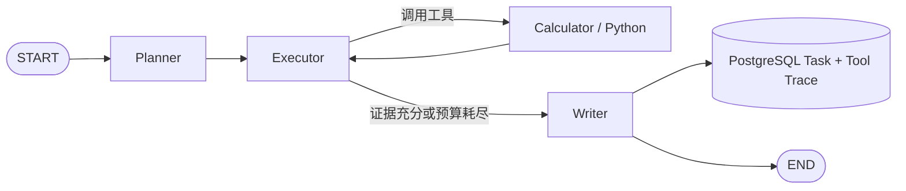

# AutoScholar

> 面向 AI/ML 研究与实验的自主智能体平台  
> Autonomous AI/ML Research & Experiment Agent Platform

AutoScholar 的目标是把复杂研究目标转化为可追踪、可恢复、可评测、可复现的研究流程。项目当前已完成 Phase 1：模型可以规划任务、选择工具、执行计算、记录轨迹，并基于证据生成最终回答。

## 当前能力

- FastAPI 服务、结构化日志、请求 ID 与统一错误响应
- PostgreSQL、Redis、Docker Compose 与 Alembic 自动迁移
- OpenAI-compatible `LLMProvider`，支持原生 Function Calling
- LangGraph 最小闭环：`Planner → Executor ⇄ Tools → Writer`
- Calculator 安全算术表达式工具
- 受限 Python 子进程工具
- Agent 任务和 Tool Trace 持久化
- 同步执行 API 与任务回查 API

Phase 1 不包含 Web Search、论文检索、RAG、异步任务队列和断点恢复；这些能力将在后续阶段加入。

## 工作流



默认预算：最多 6 次执行迭代、4 次工具调用、8 个计划步骤。预算耗尽时，任务状态为 `budget_exceeded`，Writer 会利用已有证据给出带限制说明的部分答案。

## 快速开始

### 环境要求

- Python 3.12
- [`uv`](https://docs.astral.sh/uv/)
- Docker Desktop（包含 Docker Compose）

当前 Windows 开发环境把 Docker Desktop 安装在 `D:\Applications\Docker`，运行数据保存在 `D:\DockerData\wsl`，避免镜像和卷占用系统盘。其他环境可自行选择安装位置。

### 配置模型

```powershell
Copy-Item .env.example .env
```

在本地 `.env` 中填写 OpenAI-compatible 服务：

```dotenv
LLM_BASE_URL=https://your-provider.example/v1
LLM_API_KEY=your-api-key
LLM_MODEL=your-model
```

Phase 1 只使用原生 Function Calling，不提供 JSON Prompt 降级方案。模型至少需要支持 `tools` 和 `tool_choice=auto`；若未返回要求的原生工具调用，任务会明确失败并持久化错误。`.env` 已被 Git 忽略，禁止把密钥提交到仓库或粘贴到日志、Issue。

### 使用 Docker 启动

```powershell
docker compose up -d --build
docker compose ps -a
```

`migrate` 服务会先执行 `alembic upgrade head`，成功后 API 才会启动。API 默认地址为 `http://localhost:8000`，交互式文档位于 `http://localhost:8000/docs`。

停止服务：

```powershell
docker compose down
```

命名卷会保留 PostgreSQL 与 Redis 数据。除非确认需要清空数据，否则不要执行 `docker compose down -v`。

### 本地开发

```powershell
uv sync --all-groups
uv run alembic upgrade head
uv run uvicorn autoscholar.main:app --reload
```

## API

| 方法 | 路径 | 说明 |
|---|---|---|
| `GET` | `/health/live` | API 进程存活检查 |
| `GET` | `/health/ready` | PostgreSQL、Redis 和 LLM 配置状态 |
| `POST` | `/chat` | 无状态单轮模型调用 |
| `POST` | `/agent/run` | 同步运行最小 Agent 闭环 |
| `GET` | `/agent/tasks/{task_id}` | 回查任务、指标和 Tool Trace |

运行 Agent：

```powershell
$body = @{
  objective = "分析函数 y=x² 在 0 到 10 区间的单调性、极值、导数和顶点"
} | ConvertTo-Json

$result = Invoke-RestMethod `
  -Method Post `
  -Uri "http://localhost:8000/agent/run" `
  -ContentType "application/json" `
  -Body $body

$result | ConvertTo-Json -Depth 10
```

回查已持久化任务：

```powershell
Invoke-RestMethod `
  -Uri "http://localhost:8000/agent/tasks/$($result.task_id)" |
  ConvertTo-Json -Depth 10
```

成功响应包含 `task_id`、`status`、`plan`、`answer`、`tool_calls`、模型调用/Token 指标和 `request_id`。失败响应也会携带 `task_id`，可用它查询已保存的错误状态。

## 受限 Python 的边界

Python 工具会先做 AST 白名单检查，再使用 `python -I -S`、空临时目录和最小环境启动独立子进程。当前限制包括：

- 代码最多 4,000 字符
- 执行超时 3 秒
- 输出最多 16,000 字符
- 禁止 import、文件、网络、进程、属性访问、函数/类定义、异常结构和 `while`

这是降低误用风险的 Phase 1 受限执行器，不是操作系统级强安全沙箱，也不适合运行不可信用户代码。真正隔离的 Docker 实验执行器属于后续阶段。

## 测试

```powershell
uv run ruff check src tests migrations
uv run mypy
uv run pytest
```

Compose 服务健康后运行真实基础设施测试：

```powershell
$env:AUTOSCHOLAR_RUN_INTEGRATION="1"
uv run pytest tests/integration -m integration
```

## 开发路线

| 阶段 | 重点 |
|---|---|
| Phase 0 | 工程骨架、基础设施、统一 LLM Provider、`/chat` |
| Phase 1 | 最小 LangGraph Agent、Calculator/Python、任务与轨迹持久化 |
| Phase 2–3 | Web/论文检索、Evidence/Citation、RAG 知识库 |
| Phase 4–6 | 代码生成与修复、Docker 实验、Reviewer/Replanning |
| Phase 7–9 | Checkpoint、Memory、Human-in-the-loop、MCP、Web 工作台 |
| Phase 10–11 | 全链路评测、安全加固、CI/CD 与部署 |

## 分支与提交约定

- 日常开发和阶段同步使用 `dev`。
- 每个关键模块通过测试后独立提交并推送到 `origin/dev`。
- `main` 是受审核分支；任何合并都必须由项目所有者单独检查并明确批准。
- 本地设计文档、`.env` 和运行产物不得提交。
