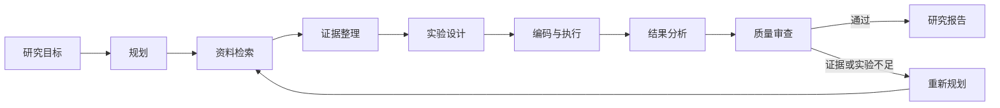

# AutoScholar

> 面向 AI/ML 研究与实验的长任务自主智能体平台  
> Autonomous AI/ML Research & Experiment Agent Platform

> [!IMPORTANT]
> AutoScholar 目前已完成 Phase 0 工程骨架，正在进入最小 Agent 阶段。本文后续能力为项目目标，将按里程碑逐步实现。

## 项目简介

AutoScholar 希望将一个复杂的 AI/ML 研究目标转化为可追踪、可恢复、可评测、可复现的完整研究流程。它不止回答问题，还将围绕目标自主规划任务、检索资料、整理证据、生成代码、执行实验、分析结果，并在质量不足时重新规划，最终产出带引用的研究报告。

一个典型任务是：

> 比较 ResNet18 与 Vision Transformer 在 CIFAR-10 小样本场景下的性能差异，并结合相关论文分析产生差异的原因。

## 核心工作流



系统的核心执行模式是：

```text
Plan → Retrieve → Reason → Act → Observe → Evaluate → Replan → Final Answer
```

## 目标能力

- **Agent 编排**：基于显式状态和工作流执行长任务，支持规划、审查、重规划与预算控制。
- **Research 与 RAG**：联合检索论文、Web 和本地知识库，提供可追溯的 Evidence 与 Citation。
- **Coding**：分析代码仓库，创建或修改 Python/PyTorch 代码，并进行静态检查与错误修复。
- **Experiment**：在受限 Docker 沙箱中执行实验，收集指标、日志、图表和模型等产物。
- **Memory 与 HITL**：保存任务、项目和历史经验，在高风险或高成本操作前请求人工审批。
- **Evaluation**：从任务成功率、检索质量、工具调用、代码测试、延迟与成本等维度评测系统。

## 架构概览

AutoScholar 计划采用一个主 LangGraph 与多个专业子图，而不是让多个独立 Agent 自由对话：

```text
Task Intake
    ↓
Planner
    ├── Research Subgraph
    ├── Coding Subgraph
    └── Experiment Subgraph
              ↓
           Reviewer
          ↙        ↘
      Replanner    Writer
```

拟采用的主要技术栈：

| 领域 | 技术 |
|---|---|
| Agent 编排 | LangGraph、LangChain Model/Tool Adapter |
| 后端与任务 | FastAPI、Celery |
| 数据与缓存 | PostgreSQL、Redis |
| 检索 | Qdrant、BM25、RRF、Reranker |
| 实验执行 | Docker、Python、PyTorch |
| 前端 | React、TypeScript、Ant Design |
| 可观测与评测 | Node/Tool Trace、Benchmark、Ablation Study |

模型层将通过统一的 `LLMProvider` 接口解耦具体供应商，以支持不同模型的效果、成本与延迟对比。工具层会先以原生工具跑通端到端流程，再逐步迁移到 MCP。

## 开发路线

| 里程碑 | 对应阶段 | 主要成果 |
|---|---|---|
| 1. Research Assistant | Phase 0–3 | 工程骨架、最小 Agent、论文/Web 检索、Evidence/Citation、RAG 知识库 |
| 2. Autonomous Experiment Agent | Phase 4–6 | 代码生成与修复、Docker 实验、结果分析、Reviewer 与 Replanning |
| 3. AutoScholar Platform | Phase 7–9 | Checkpoint、Memory、Human-in-the-loop、MCP 与完整 Web 工作台 |
| 4. Evaluation & Production | Phase 10–11 | 全链路评测、消融实验、安全加固、CI/CD 与部署 |

项目将遵循以下演进原则：

```text
先跑通 → 再自动化 → 再智能化 → 再平台化 → 最后评测
```

### 当前状态：Phase 0 已完成

- [x] Python 3.12 + `uv` 工程和质量门禁
- [x] FastAPI、配置管理、结构化日志与请求追踪
- [x] PostgreSQL、Redis 和 Docker Compose
- [x] 统一 LLM Provider 与 OpenAI-compatible 实现
- [x] `POST /chat`、健康检查和自动化测试

真实模型调用需要开发者提供自己的兼容服务地址、API Key 和模型名。凭据仅保存在本地 `.env`，不会进入 Git。

## 快速开始

### 环境要求

- Python 3.12
- [`uv`](https://docs.astral.sh/uv/)
- Docker Desktop（包含 Docker Compose）

本项目当前 Windows 开发环境将 Docker Desktop 安装在 `D:\Applications\Docker`，运行数据存放在 `D:\DockerData\wsl`，避免镜像与卷占用系统盘。其他环境可以使用自己的安装位置。

### 配置

```powershell
Copy-Item .env.example .env
```

如需调用真实模型，在 `.env` 中填写：

```dotenv
LLM_BASE_URL=https://your-provider.example/v1
LLM_API_KEY=your-api-key
LLM_MODEL=your-model
```

不要提交 `.env` 或在日志、Issue 中粘贴密钥。

### 使用 Docker 启动

```powershell
docker compose up -d --build
docker compose ps
```

API 默认监听 `http://localhost:8000`，交互式文档位于 `http://localhost:8000/docs`。

停止服务：

```powershell
docker compose down
```

命名卷会保留 PostgreSQL 和 Redis 数据；如无明确需要，不要使用 `docker compose down -v`。

### 本地开发

```powershell
uv sync --all-groups
uv run uvicorn autoscholar.main:app --reload
```

### 接口

| 方法 | 路径 | 说明 |
|---|---|---|
| `GET` | `/health/live` | API 进程存活检查 |
| `GET` | `/health/ready` | PostgreSQL、Redis 与 LLM 配置状态 |
| `POST` | `/chat` | 无状态单轮模型调用 |

`POST /chat` 请求示例：

```json
{
  "message": "分析 y=x² 在 0~10 区间的变化趋势"
}
```

### 测试

```powershell
uv run ruff check .
uv run mypy src tests
uv run pytest
```

Compose 服务启动后，可以运行真实基础设施测试：

```powershell
$env:AUTOSCHOLAR_RUN_INTEGRATION="1"
uv run pytest tests/integration -m integration
```

## 分支与提交约定

- 日常开发与阶段性同步使用 `dev` 分支。
- 每个关键模块通过测试后独立提交并推送到 `origin/dev`。
- `main` 是受审核分支；所有合并都必须由项目所有者单独检查并明确批准。
- 本地设计文档、`.env` 和运行产物不得提交。

## 最终演示目标

最终 Demo 将围绕一个完整研究任务展开：比较 CNN 与 Vision Transformer 在 CIFAR-10 小数据场景下的表现。AutoScholar 将自主完成问题拆解、论文与知识库检索、证据整理、实验设计、代码生成、模型训练、错误恢复、指标分析、质量审查、补充实验和报告生成。

这个任务用于同时验证 Planning、Research、RAG、Tool Calling、Coding、PyTorch、Sandbox、Replanning、Memory、Human-in-the-loop 与 Evaluation，而非仅展示一次性问答。

## 参与项目

项目尚处于早期阶段，欢迎通过 GitHub Issue 或 Discussion 交流使用场景、架构建议和评测思路。贡献规范与许可证将在后续阶段补充。
