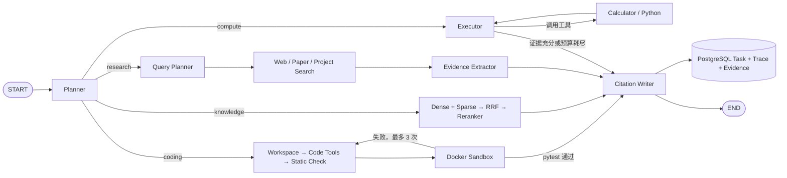

# AutoScholar

> 面向 AI/ML 研究与实验的自主智能体平台  
> Autonomous AI/ML Research & Experiment Agent Platform

AutoScholar 的目标是把复杂研究目标转化为可追踪、可恢复、可评测、可复现的研究流程。当前支持 Web/论文研究、项目知识库、隔离代码执行与 MNIST 实验，已具备持久化自主工作流与 MCP 工具平台；Phase 9 正在分模块构建本地 Web 工作台。

## 当前能力

- FastAPI 服务、结构化日志、请求 ID 与统一错误响应
- PostgreSQL、Redis、Docker Compose 与 Alembic 自动迁移
- OpenAI-compatible `LLMProvider`，支持原生 Function Calling
- LangGraph 最小闭环：`Planner → Executor ⇄ Tools → Writer`
- Calculator 安全算术表达式工具
- 受限 Python 子进程工具
- Tavily Web Search 与 Semantic Scholar Paper Search
- Query Planner、Evidence Extractor 与 Citation Writer
- PDF 上传、文本解析、结构感知分块与可恢复后台摄取任务
- Qdrant Dense + BM25 Sparse 检索、RRF 融合与 BGE Reranker
- 独立 RAG Query API 与 Agent `knowledge` 模式
- 本地文档、Web 和论文来源统一进入 Evidence Pool
- Recall@K、HitRate@K、MRR、NDCG RAG Benchmark
- Evidence、Claim-Citation 映射和降级警告持久化
- Agent 任务和 Tool Trace 持久化
- Coding Agent：生成、搜索、读取、原子修改和删除任务源码
- 静态检查、pytest、结构化错误分类和最多 3 次自动修复
- 断网、非 root、限制 CPU/内存/PID/时长的一次性 Docker 沙箱
- 真实 MNIST 只读数据卷与 CPU PyTorch 运行环境
- 同步执行 API 与任务回查 API
- 本地 Web 工作台：项目/任务快照、项目/PDF 管理、持久化任务提交与实时事件回放（9A–9D）

当前 PDF 管线只处理可提取文本的 PDF，不执行 OCR；扫描件和加密 PDF 会明确失败。Web/论文检索仍只使用搜索片段与论文摘要，不自动下载外部全文。

## 工作流


```mermaid
flowchart LR
    S([START]) --> P[Planner]
    P -->|compute| E[Executor]
    E -->|调用工具| T[Calculator / Python]
    T --> E
    P -->|research| Q[Query Planner]
    Q --> R[Web / Paper / Project Search]
    R --> V[Evidence Extractor]
    P -->|knowledge| K[Dense + Sparse → RRF → Reranker]
    P -->|coding| C[Workspace → Code Tools → Static Check]
    C --> D[Docker Sandbox]
    D -->|失败，最多 3 次| C
    D -->|pytest 通过| W
    K --> W
    V --> W[Citation Writer]
    E -->|证据充分或预算耗尽| W
    W --> X[(PostgreSQL Task + Trace + Evidence)]
    W --> F([END])
```

默认预算：最多 6 次执行迭代、4 次工具调用、8 个计划步骤。预算耗尽时，任务状态为 `budget_exceeded`，Writer 会利用已有证据给出带限制说明的部分答案。

## 快速开始

### 环境要求

- Python 3.12
- [`uv`](https://docs.astral.sh/uv/)
- Docker Desktop（包含 Docker Compose）

当前 Windows 开发环境把 Docker Desktop 安装在 `D:\Applications\Docker`，运行数据保存在 `D:\DockerData\wsl`，避免镜像和卷占用系统盘。其他环境可自行选择安装位置。

### 配置模型

```powershell
Copy-Item .env.example .env
```

在本地 `.env` 中填写 OpenAI-compatible 服务：

```dotenv
LLM_BASE_URL=https://your-provider.example/v1
LLM_API_KEY=your-api-key
LLM_MODEL=your-model

TAVILY_API_KEY=your-tavily-api-key
# 可选但推荐；匿名 Semantic Scholar API 也可使用
SEMANTIC_SCHOLAR_API_KEY=your-semantic-scholar-api-key
```

Agent 只使用原生 Function Calling，不提供 JSON Prompt 降级方案。模型至少需要支持 `tools` 和 `tool_choice=auto`；若未返回要求的原生工具调用，任务会明确失败并持久化错误。`.env` 已被 Git 忽略，禁止把任何密钥提交到仓库或粘贴到日志、Issue。

### 使用 Docker 启动

```powershell
docker compose up -d --build
docker compose ps -a
```

`migrate` 服务会先执行 `alembic upgrade head`，成功后 API 才会启动。API 默认地址为 `http://localhost:8000`，交互式文档位于 `http://localhost:8000/docs`。

停止服务：

```powershell
docker compose down
```

命名卷会保留 PostgreSQL、Redis、Qdrant、PDF 原文件和本地模型缓存。除非确认需要清空全部数据，否则不要执行 `docker compose down -v`。

首次使用 Coding Agent 前，需要联网准备一次真实 MNIST 数据；之后任务沙箱始终断网运行：

```powershell
docker compose build sandbox-image
docker compose --profile datasets run --rm mnist-init
docker compose up -d --build
```

该操作只写入 `autoscholar_mnist_data` Docker 卷，不会把数据写入 Git。

### 本地开发

```powershell
uv sync --all-groups
uv run alembic upgrade head
uv run uvicorn autoscholar.main:app --reload
```

## API

| 方法 | 路径 | 说明 |
|---|---|---|
| `GET` | `/health/live` | API 进程存活检查 |
| `GET` | `/health/ready` | PostgreSQL、Redis 和 LLM 配置状态 |
| `POST` | `/chat` | 无状态单轮模型调用 |
| `POST` | `/agent/run` | 同步运行最小 Agent 闭环 |
| `GET` | `/agent/tasks/{task_id}` | 回查任务、指标和 Tool Trace |
| `GET` | `/agent/tasks/{task_id}/evidence` | 分页查询结构化 Evidence |
| `GET` | `/agent/tasks/{task_id}/workspace` | 查询 Coding 任务工作区清单和校验值 |
| `GET` | `/agent/tasks/{task_id}/workspace/files/{path}` | 读取工作区 UTF-8 文本文件 |
| `POST` | `/projects` | 创建隔离的知识库项目 |
| `GET` | `/projects`、`/projects/{project_id}` | 列出或读取项目 |
| `POST` | `/projects/{project_id}/documents` | 上传 PDF 并进入后台摄取队列 |
| `GET` | `/projects/{project_id}/documents` | 查询 PDF 处理状态 |
| `GET` | `/projects/{project_id}/documents/{document_id}/content` | 受控读取 PDF 原文件 |
| `POST` | `/projects/{project_id}/documents/{document_id}/retry` | 重试失败的 PDF |
| `POST` | `/projects/{project_id}/documents/{document_id}/reindex` | 重新解析和索引 PDF |
| `DELETE` | `/projects/{project_id}/documents/{document_id}` | 异步删除原文件、元数据和向量 |
| `POST` | `/projects/{project_id}/rag/query` | 查询项目知识库并返回页码证据 |

运行 Agent：

```powershell
$body = @{
  objective = "调研 LoRA、QLoRA 和 DoRA 的核心区别"
  mode = "research"
} | ConvertTo-Json -Compress

$bytes = [System.Text.Encoding]::UTF8.GetBytes($body)

$result = Invoke-RestMethod `
  -Method Post `
  -Uri "http://127.0.0.1:8000/agent/run" `
  -ContentType "application/json; charset=utf-8" `
  -Body $bytes `
  -TimeoutSec 180

$result | ConvertTo-Json -Depth 10
```

回查已持久化任务：

```powershell
Invoke-RestMethod `
  -Uri "http://127.0.0.1:8000/agent/tasks/$($result.task_id)" |
  ConvertTo-Json -Depth 10
```

查询 Evidence：

```powershell
Invoke-RestMethod `
  -Uri "http://127.0.0.1:8000/agent/tasks/$($result.task_id)/evidence?limit=50&offset=0" |
  ConvertTo-Json -Depth 10
```

`mode` 支持 `auto`、`research`、`compute`、`knowledge` 和 `coding`，默认 `auto`。`knowledge` 必须携带 `project_id`；可用 `document_ids` 进一步缩小范围。`research` 携带 `project_id` 时会混合本地文档和外部证据；`research_sources` 可选择 `web`、`paper` 或两者，默认 `@("web", "paper")`。`coding` 在任务专属工作区内创建项目，只有静态检查和 pytest 都通过才会返回 `succeeded`。失败响应也会携带 `task_id`，可回查持久化错误和 Tool Trace。

## 受限 Python 的边界

Python 工具会先做 AST 白名单检查，再使用 `python -I -S`、空临时目录和最小环境启动独立子进程。当前限制包括：

- 代码最多 4,000 字符
- 执行超时 3 秒
- 输出最多 16,000 字符
- 禁止 import、文件、网络、进程、属性访问、函数/类定义、异常结构和 `while`

这是 Phase 1 的轻量计算器，不适合运行生成项目。Phase 4 Coding Agent 使用单独的 Docker 沙箱：API 不直接持有 Docker Socket；内部管理服务为每次运行创建一次性、断网、非 root 容器，而且不会向容器传递 AutoScholar 的 `.env` 或外部服务密钥。

## 测试

```powershell
uv run ruff check src tests migrations
uv run mypy
uv run pytest
```

Compose 服务健康后运行真实基础设施测试：

```powershell
$env:AUTOSCHOLAR_RUN_INTEGRATION="1"
uv run pytest tests/integration -m integration
```

### Phase 2 验收要点

使用上面的 LoRA/QLoRA/DoRA 请求完成真实验收后，确认：

- `status` 为 `succeeded`；如果某个外部服务失败，则应为 `partial` 而不是伪造完整结果
- `tool_calls` 同时包含 `web_search` 和 `paper_search`
- LoRA、QLoRA、DoRA 各有来自原始论文的 Evidence
- `answer` 中的 `[E#]` 都能在 `evidence` 和独立 Evidence 接口中找到
- `citations` 中每个主要 Claim 都至少绑定一个 Evidence ID
- API 重启后仍能通过 `task_id` 查到 Answer、Trace、Evidence 和 Citation

自动化测试使用 Mock Provider，不消耗 Tavily 或 Semantic Scholar API 配额。真实验收需要在本地 `.env` 配置 Tavily Key；Semantic Scholar 匿名接口可能受共享限流影响，因此建议同时配置其 API Key。

### Phase 3 本地验收

以下命令适用于 Windows PowerShell。先启动 Compose，并确认 `api`、`worker`、`postgres`、`redis`、`qdrant` 为正常状态：

```powershell
docker compose up -d --build
docker compose ps -a
Invoke-RestMethod http://127.0.0.1:8000/health/ready |
  ConvertTo-Json -Depth 5
```

创建项目：

```powershell
$projectBody = @{ name = "Phase 3 验收"; description = "本地论文知识库" } |
  ConvertTo-Json -Compress
$project = Invoke-RestMethod `
  -Method Post `
  -Uri "http://127.0.0.1:8000/projects" `
  -ContentType "application/json; charset=utf-8" `
  -Body ([System.Text.Encoding]::UTF8.GetBytes($projectBody))
$projectId = $project.id
```

准备一个可复制文本的 PDF，把路径替换为你的实际文件。使用 `curl.exe` 可兼容 Windows PowerShell 5.1 的 multipart 上传：

```powershell
$pdfPath = "D:\papers\lora.pdf"
$uploadJson = curl.exe -sS -X POST `
  "http://127.0.0.1:8000/projects/$projectId/documents" `
  -F "file=@$pdfPath;type=application/pdf" `
  -F "title=LoRA Paper"
$document = $uploadJson | ConvertFrom-Json
$documentId = $document.id
```

后台 Worker 首次运行会下载 Dense 和 BM25 模型。轮询直到 `ready`；如果变为 `failed`，命令会输出错误码和错误信息：

```powershell
do {
  Start-Sleep -Seconds 2
  $document = Invoke-RestMethod `
    "http://127.0.0.1:8000/projects/$projectId/documents/$documentId"
  $document | Select-Object status,page_count,chunk_count,index_version,error_code,error_message
} while ($document.status -in @("queued", "processing"))

if ($document.status -ne "ready") { throw "PDF indexing failed: $($document.error_code)" }
```

执行默认的 Hybrid + Reranker 查询。首次查询还会下载 Reranker 模型，因此耗时会明显长于后续请求：

```powershell
$ragBody = @{
  question = "这篇论文提出了什么方法？请指出依据。"
  document_ids = @($documentId)
  retrieval_mode = "hybrid_rerank"
  top_k = 5
} | ConvertTo-Json -Depth 5 -Compress

$rag = Invoke-RestMethod `
  -Method Post `
  -Uri "http://127.0.0.1:8000/projects/$projectId/rag/query" `
  -ContentType "application/json; charset=utf-8" `
  -Body ([System.Text.Encoding]::UTF8.GetBytes($ragBody)) `
  -TimeoutSec 300

$rag.answer
$rag.evidence | Format-Table citation_key,title,page,section,relevance,document_id,chunk_id
$rag.citations | ConvertTo-Json -Depth 5
```

验收时确认：`evidence` 全部属于当前项目和选定文档；每项都有 `page`、原文 `excerpt` 与 `chunk_id`；回答里的 `[E#]` 都存在于 `evidence`，且 `citations` 的映射一致。还可以把 `retrieval_mode` 分别改为 `dense`、`sparse`、`hybrid` 做对照。

通过 Agent 验收 `knowledge` 路由：

```powershell
$agentBody = @{
  objective = "根据我上传的论文解释其核心方法"
  mode = "knowledge"
  project_id = $projectId
  document_ids = @($documentId)
  retrieval_mode = "hybrid_rerank"
} | ConvertTo-Json -Depth 5 -Compress

$agent = Invoke-RestMethod `
  -Method Post `
  -Uri "http://127.0.0.1:8000/agent/run" `
  -ContentType "application/json; charset=utf-8" `
  -Body ([System.Text.Encoding]::UTF8.GetBytes($agentBody)) `
  -TimeoutSec 300

$agent | ConvertTo-Json -Depth 10
Invoke-RestMethod "http://127.0.0.1:8000/agent/tasks/$($agent.task_id)" |
  ConvertTo-Json -Depth 10
```

使用 Tavily 验收本地与外部资料混合，同时避免 Semantic Scholar 匿名限流影响本阶段结果：

```powershell
$mixedBody = @{
  objective = "对照上传论文和 Web 资料，解释 LoRA 的参数效率、初始化和推理行为"
  mode = "research"
  project_id = $projectId
  document_ids = @($documentId)
  retrieval_mode = "hybrid_rerank"
  research_sources = @("web")
} | ConvertTo-Json -Depth 6 -Compress

$mixed = Invoke-RestMethod `
  -Method Post `
  -Uri "http://127.0.0.1:8000/agent/run" `
  -ContentType "application/json; charset=utf-8" `
  -Body ([System.Text.Encoding]::UTF8.GetBytes($mixedBody)) `
  -TimeoutSec 600

$mixed | ConvertTo-Json -Depth 10

if ($mixed.status -ne "succeeded") { throw "Mixed research failed: $($mixed.status)" }
if (-not ($mixed.tool_calls | Where-Object { $_.tool_name -eq "web_search" -and $_.status -eq "succeeded" })) {
  throw "Tavily web_search did not succeed"
}
if (-not ($mixed.tool_calls | Where-Object { $_.tool_name -eq "knowledge_search" -and $_.status -eq "succeeded" })) {
  throw "Local knowledge_search did not succeed"
}
if ($mixed.tool_calls | Where-Object { $_.tool_name -eq "paper_search" }) {
  throw "paper_search should not run when research_sources contains only web"
}
if (-not ($mixed.evidence | Where-Object { $_.provider -eq "tavily" -and $_.source_type -eq "web" })) {
  throw "Tavily Evidence is missing"
}
if (-not ($mixed.evidence | Where-Object {
  $_.provider -eq "qdrant" -and $_.source_type -eq "document" -and
  $_.document_id -eq $documentId -and $_.chunk_id -and $_.page
})) {
  throw "Project document Evidence is missing or out of scope"
}
```

验收结果必须同时包含 Tavily `web` 和 Qdrant `document` Evidence，且本地 Evidence 的 `excerpt` 是服务器保存的原始 PDF 分块，不依赖模型逐字符复写。若需要完整 Web + 论文研究，省略 `research_sources` 或指定 `@("web", "paper")`；此时 Semantic Scholar 失败会如实返回 `partial`。

RAG Benchmark 示例位于 `benchmarks/rag/example.jsonl`。把占位 ID 替换为人工标注的 `document_id`/`chunk_id` 后运行：

```powershell
uv run python -m autoscholar.evaluation.rag `
  --dataset benchmarks/rag/my-benchmark.jsonl `
  --project-id $projectId `
  --modes dense sparse hybrid hybrid_rerank `
  --ks 5 10
```

### Phase 4 本地验收

以下命令适用于当前 Windows 环境，并显式使用 D 盘安装的 Docker：

```powershell
$docker = "D:\Applications\Docker\resources\bin\docker.exe"
& $docker compose build sandbox-image
& $docker compose --profile datasets run --rm mnist-init
& $docker compose up -d --build
& $docker compose ps -a

$health = Invoke-RestMethod "http://127.0.0.1:8000/health/ready"
$health.capabilities | Format-List
if ($health.capabilities.sandbox.status -ne "ok") { throw "Sandbox is not ready" }
if ($health.capabilities.mnist_dataset.status -ne "ok") { throw "MNIST is not ready" }

& $docker compose exec -T sandbox-manager python -m autoscholar.sandbox.smoke
```

执行真实 Coding Agent 任务：

```powershell
$codingBody = @{
  objective = @"
在空工作区中创建一个小型、可测试的 PyTorch MNIST MLP 项目。
要求包含模型、训练入口和 pytest；使用 MNIST_ROOT 环境变量、download=False、固定随机种子，
测试真实 MNIST 的一个小批次，验证输出形状、有限损失以及反向传播后参数发生更新。
"@
  mode = "coding"
} | ConvertTo-Json -Compress

$coding = Invoke-RestMethod `
  -Method Post `
  -Uri "http://127.0.0.1:8000/agent/run" `
  -ContentType "application/json; charset=utf-8" `
  -Body ([System.Text.Encoding]::UTF8.GetBytes($codingBody)) `
  -TimeoutSec 1800

$coding | ConvertTo-Json -Depth 10
if ($coding.status -ne "succeeded") { throw "Coding task failed" }
if ($coding.mode -ne "coding") { throw "Coding mode was not used" }
if (-not ($coding.tool_calls | Where-Object { $_.tool_name -eq "static_check" -and $_.status -eq "succeeded" })) {
  throw "Static check did not pass"
}
if (-not ($coding.tool_calls | Where-Object { $_.tool_name -eq "run_pytest" -and $_.status -eq "succeeded" })) {
  throw "pytest did not pass"
}
```

查看生成文件、校验值和持久化执行日志：

```powershell
$workspace = Invoke-RestMethod `
  "http://127.0.0.1:8000/agent/tasks/$($coding.task_id)/workspace"
$workspace.files | Format-Table path,size_bytes,sha256

$sourcePath = ($workspace.files | Where-Object { $_.path -like "source/*.py" } |
  Select-Object -First 1).path
$encodedPath = ($sourcePath -split "/" | ForEach-Object {
  [System.Uri]::EscapeDataString($_)
}) -join "/"
Invoke-RestMethod `
  "http://127.0.0.1:8000/agent/tasks/$($coding.task_id)/workspace/files/$encodedPath" |
  Select-Object path,content
```

自动化验收中的故障脚本会先制造 `SyntaxError`，确认错误被分类后由 Agent 修改文件并重新运行；因此不要求真实模型每次都故意产生错误。可单独执行：

```powershell
uv run pytest tests/test_coding_agent.py tests/test_coding_workspace.py tests/test_sandbox.py
```

Phase 4 验收标准是：工作区不能越界，沙箱看不到密钥且不能联网，超时会终止并清理容器，真实 MNIST 项目静态检查和 pytest 通过，强制故障用例至少完成一次修复。模型检查点、图表、实验指标和通用 Artifact 生命周期留到 Phase 5。

## Phase 5 本地验收

实验模式会在断网、只读根文件系统的 Docker 沙箱中，用固定种子的 MNIST 子集训练 MLP 与 CNN，并保存实测指标、曲线、模型 checkpoint 和报告。默认配置为每个模型训练 2 轮；最小验收可使用每模型 1 轮、128 条训练样本和 128 条测试样本。小样本结果仅用于工程验收，不代表完整 MNIST 基准性能。

首次使用前，先按上文准备 MNIST 数据集。启动服务后，可运行无需 LLM 密钥的真实训练验收：

```powershell
$docker = "D:\Applications\Docker\resources\bin\docker.exe"
& $docker compose up -d --build
& $docker compose exec -T api python -m autoscholar.experiment.smoke
```

成功时输出 `status: succeeded`、两种模型的实测准确率、数据集 SHA-256 和 `artifacts: 10`。该命令会在本地数据库和工作区留下一个验收任务。请勿将固定子集的单次结果解读为模型优劣结论。

对外开放实验 API 前，在本地 `.env` 中设置足够长的随机 `EXPERIMENT_API_TOKEN`，并重新创建 API 容器：

```powershell
& $docker compose up -d --force-recreate api
$token = Read-Host "EXPERIMENT_API_TOKEN"
$headers = @{ Authorization = "Bearer $token" }
$body = @{
  objective = "Compare MLP and CNN on MNIST"
  mode = "experiment"
  experiment_specification = @{
    epochs = 1
    train_samples = 128
    test_samples = 128
  }
} | ConvertTo-Json -Depth 5 -Compress
$result = Invoke-RestMethod -Method Post `
  -Uri "http://127.0.0.1:8000/agent/run" `
  -Headers $headers `
  -ContentType "application/json; charset=utf-8" `
  -Body ([System.Text.Encoding]::UTF8.GetBytes($body)) `
  -TimeoutSec 900
$result | ConvertTo-Json -Depth 10
```

实验 API 默认关闭；未配置 token 时返回 503，缺少或错误的 token 返回 401。`/agent/run` 的实验模式会调用已配置的 LLM 生成计划，内部 smoke 验收则不消耗 LLM 配额。查询、下载也必须带相同的 `$headers`：

```powershell
$taskId = $result.task_id
$experiments = Invoke-RestMethod -Headers $headers `
  "http://127.0.0.1:8000/agent/tasks/$taskId/experiments"
$artifacts = Invoke-RestMethod -Headers $headers `
  "http://127.0.0.1:8000/agent/tasks/$taskId/artifacts"
$artifacts.items | Format-Table id,path,size_bytes,sha256
$report = $artifacts.items | Where-Object path -eq "reports/report.md" | Select-Object -First 1
Invoke-WebRequest -Headers $headers `
  "http://127.0.0.1:8000/agent/tasks/$taskId/artifacts/$($report.id)" `
  -OutFile "data/phase5-report.md"
```

还可通过 `/agent/tasks/{task_id}` 查看状态与执行轨迹，通过 `/agent/tasks/{task_id}/experiments/{experiment_id}` 查看实验详情。实验产物按任务隔离、下载前校验 SHA-256；`.env`、设计文档、数据集和训练产物都不得提交到 Git。

## Phase 6 本地验收

显式使用 `mode: autonomous` 才会启动完整工作流；`auto` 不会升级到自主实验。入口、父任务、子任务、历史和产物均使用现有 `EXPERIMENT_API_TOKEN` 鉴权。执行范围仍为 CPU / MNIST / MLP 与 CNN 对比，不支持任意数据集或 GPU。

流程为结构化 DAG 计划 → 研究/代码/实验 → 规则与 LLM 双重审查 → 必要时重规划 → 报告。只有受影响的步骤及其下游会重跑；每轮子任务、代码快照和实验产物独立保留。低准确率或 CNN 不如 MLP 不是自动失败理由。

自主编码每轮直接检查完整的最新源码快照，仅开放创建和原子替换文件；已有源码不会通过“先删除再重建”修改。连续 8 次文件操作仍未提交验收会明确失败，不会自动当作完成。提交后仍必须通过真实静态检查与 pytest。普通 `coding` 模式保持原有工具集。下游编码继承唯一上游编码的源码，重规划保留此前快照，避免重新套用模板丢失修改。

协调器兼容只支持自动工具选择的模型，但仍要求原生工具调用及严格结构校验；格式纠正最多重试一次，全部计入共享预算。研究证据向下游传递时使用有标识的限长摘要，完整证据仍保留供审查与报告使用。

规划、编码、审查和重规划共用原始指标的 JSON Schema：训练仅输出原始指标、曲线和检查点，汇总指标、配置与报告由平台生成。不能通过增加原始指标字段来“修复”汇总产物缺失。无效模型响应也计入 tokens；无法取得 usage 时停止，不进行无计量重试。

先启动服务并应用迁移，再运行真实联测（需要配置 LLM；第二条额外需要 Tavily）：

```powershell
$docker = "D:\Applications\Docker\resources\bin\docker.exe"
& $docker compose up -d --build
& $docker compose exec -T api python -m autoscholar.orchestration.smoke
& $docker compose exec -T api python -m autoscholar.orchestration.smoke --research --inject-invalid-metrics
```

smoke 在进程内临时生成鉴权 token，不修改 `.env` 或正在运行的 API token。会消耗真实模型/检索配额，并保留数据库记录与产物。故障参数只在独立测试命令中启用：第一次真实训练完成后模拟指标产物丢失，验证 REPLAN → 新子任务重试 → PASS。成功输出 `acceptance: passed`、版本数和下载后通过 SHA-256 校验的产物数；不要将“有输出”当成验收成功。

不想调用外部 API 时，可运行 `python -m autoscholar.orchestration.smoke --offline --inject-invalid-metrics`（同样在 API 容器内）。此模式使用明确标记的脚本化模型替身，但实际执行 Docker 训练、数据库持久化、规则审查、重规划调度与下载校验；它不能替代真实 LLM / Tavily 验收，也不能与 `--research` 同用。

手动调用（先按 Phase 5 配置 token；PowerShell 用 UTF-8 字节发送请求）：

```powershell
$token = Read-Host "EXPERIMENT_API_TOKEN"
$headers = @{ Authorization = "Bearer $token" }
$body = @{
  objective = "先检索 MLP 与 CNN 的区别，再基于 MNIST 小样本实现、验证并运行对比，报告实测结果。"
  mode = "autonomous"
  research_sources = @("web")
  experiment_specification = @{ epochs = 1; train_samples = 128; test_samples = 128 }
  budget = @{ replans = 2; training_runs = 3; model_calls = 60; wall_seconds = 1800 }
} | ConvertTo-Json -Depth 8 -Compress
$result = Invoke-RestMethod -Method Post -Uri "http://127.0.0.1:8000/agent/run" `
  -Headers $headers -ContentType "application/json; charset=utf-8" `
  -Body ([System.Text.Encoding]::UTF8.GetBytes($body)) -TimeoutSec 1900
$result | ConvertTo-Json -Depth 15
$taskId = $result.task_id
$task = Invoke-RestMethod -Headers $headers "http://127.0.0.1:8000/agent/tasks/$taskId"
$plans = Invoke-RestMethod -Headers $headers "http://127.0.0.1:8000/agent/tasks/$taskId/workflow/plans"
$steps = Invoke-RestMethod -Headers $headers "http://127.0.0.1:8000/agent/tasks/$taskId/workflow/steps"
$reviews = Invoke-RestMethod -Headers $headers "http://127.0.0.1:8000/agent/tasks/$taskId/workflow/reviews"
$steps.items | Format-Table plan_version,step_id,status,child_task_id
$reviews.items | ConvertTo-Json -Depth 12
```

用步骤记录的 `child_task_id` 查询代码工作区、实验与下载产物，方法同 Phase 4/5；父任务 ID 不直接包含实验文件。研究引用使用 `子任务ID:引用键`，避免多次研究都产生 `E1` 时串引用。报告仅使用最终通过审查的结果，早期尝试保留在历史中。

预算对整项父任务共享，重规划不会清零。默认上限：20 个执行步骤、3 次重规划、60 次模型调用、50 次工具调用、20 次搜索、3 次代码修复、4 次训练、40 次沙箱运行、120000 tokens、1800 秒。请求只能降低服务端上限；可在 `.env` 设置 JSON 格式的 `AUTONOMOUS_BUDGET` 调整服务端配置，重建 API 生效。tokens 按模型返回 usage 计量，单次响应可能越过阈值；超过后立即停止后续调用，缺少 usage 也会停止，不能作为精确费用上限。

验收要求：最终任务 `succeeded`、最终 review 为 `PASS`、代码交接 SHA-256 一致、所有产物校验成功；故障测试还须至少一次 `REPLAN` 且旧记录未覆盖。达到预算时应为 `budget_exceeded` 并停止继续调用；失败详情见 `$task.error_code` / `error_message`。Phase 6 的 `/agent/run` 保持同步执行；进程重启续跑、Memory 和人工审批使用下文 Phase 7 的持久化接口。

2026-09-23 已通过真实 LLM + Tavily + Docker 故障恢复联测（任务 `31e866b3-f81b-4b4f-b386-f871d060ab0f`）：4 条 Web 证据、2 次真实训练、1 次重规划、2 版计划及审查、10 个下载产物校验通过。该成功任务使用 12 次模型调用、60283 tokens，未提高默认预算；此前失败尝试另有用量并保留原始记录。MNIST 小样本结果为 MLP 33.59%、CNN 20.31%，仅证明工程闭环，不代表完整基准性能或任意目标均能成功。

本地回归（含真实 Compose 集成检查）158 项通过；1 项符号链接测试因当前 Windows 账户权限跳过。Ruff、Mypy 与 Alembic 模型/迁移一致性检查通过。

### Phase 6 加强验收（2026-09-23）

新增 46 项确定性测试后，全量回归为 **204 项通过、1 项 Windows 符号链接权限跳过**；符号链接防护已在真实 Linux 容器补验通过。本轮发现并修复了截断 PNG、截断 checkpoint 被误接收，以及非 ASCII 鉴权头返回 500 的问题。PNG 检查完整分块与 CRC；checkpoint 检查有大小上限的 ZIP 完整性与 CRC，不解包执行、不反序列化权重。

模型替身 + 真实 PostgreSQL / Docker 验收全部通过：正常闭环、一次指标丢失后恢复、持续丢失后在 2 次训练预算处停止，以及两个任务并发时的预算与父子关系隔离。正常、恢复和并发成功任务各有 10 个下载产物通过 SHA-256 校验。额外验证了断网、非 root、无密钥/Socket、超时、显式取消及资源清理（该检查创建的 6 个容器、3 个临时卷均已移除）。这些结果不代替新增的真实 LLM/Tavily 稳定性抽测；本轮未调用外部 API。

无需外部 API 的复测命令（先更新并启动 Compose，工作目录为项目根目录）：

```powershell
docker compose exec -T api python -m autoscholar.orchestration.smoke --offline
docker compose exec -T api python -m autoscholar.orchestration.smoke --offline --inject-invalid-metrics
docker compose exec -T api python -m autoscholar.orchestration.smoke --offline --persistent-invalid-metrics

$projectRoot = (Get-Location).Path.Replace('\', '/')
docker compose run --rm --no-deps --pull never --volume "${projectRoot}/tests/integration/phase6_concurrency_acceptance.py:/tmp/phase6_concurrency_acceptance.py:ro" api python /tmp/phase6_concurrency_acceptance.py
docker compose run --rm --no-deps --pull never --volume "${projectRoot}/tests/integration/phase6_sandbox_acceptance.py:/tmp/phase6_sandbox_acceptance.py:ro" sandbox-manager python /tmp/phase6_sandbox_acceptance.py
```

持续故障用例的预期任务状态是 `budget_exceeded`，不是 `succeeded`；仍需看到脚本输出 `acceptance: passed`。新增边界用例位于 `tests/test_phase6_resilience.py`，覆盖预算阈值、非法重规划、协议错误、审查等待期间篡改、四阶段取消、并发、鉴权和上游服务失败。Linux 检查只核对自己创建的资源，不清理其他任务。恢复记录保留在本地数据库与工作区，不上传 Git。

## Phase 7：持久化执行、人工审批与 Memory

`workflow-worker` 独立处理 PostgreSQL 队列，每个 Planner、单个执行步骤、Reviewer、Replanner、Writer 完成后保存版本化 JSON 检查点。任务及预算跨进程保存；外部调用前后记录账本。数据库租约、心跳与执行代次防止多个 Worker 重复领取同一任务。

任务从 `queued` 进入 `running`，步骤间重新排队。pause 请求在当前有界步骤完成后进入 `paused`，resume 后继续剩余步骤；已使用的 tokens、调用和训练次数不清零，人工等待时间不计入有效执行时长。cancel 终止当前任务，已完成记录和产物保留。

检查点与工作区校验不一致，或服务中断导致外部调用结果不明时，任务进入 `recovery_required`，普通 resume 返回 409，不自动重放潜在付费调用。可从 execution、事件和子任务记录检查原因，再取消任务。已完成并落库的步骤可核对后复用。恢复粒度是工作流步骤，不支持训练中途从 epoch 接续。

### 接口

以下接口全部要求 `Authorization: Bearer <EXPERIMENT_API_TOKEN>`。当前为单操作者 Token 模式，项目隔离指检索范围隔离，不是多用户权限系统。

| 接口 | 用途 |
|---|---|
| `POST /agent/tasks` | 异步提交，要求 `mode=autonomous` 和 `Idempotency-Key`；返回 202 |
| `GET /agent/tasks/{id}` | 任务结果与统计 |
| `GET /agent/tasks/{id}/execution` | 当前节点、预算、未确认调用 |
| `POST /agent/tasks/{id}/pause`、`resume`、`cancel` | 生命周期控制 |
| `GET /agent/tasks/{id}/durable/checkpoints`、`events` | 检查点摘要、执行审计 |
| `GET /agent/tasks/{id}/approvals` | 审批记录及操作摘要 |
| `POST /agent/tasks/{id}/approvals/{approval_id}/decision` | approve / reject / modify |
| `GET /agent/tasks/{id}/memory` | 任务摘要、子步骤引用、检索到的记忆 |
| `GET /projects/{id}/memory`、`PUT /projects/{id}/memory` | 项目上下文；更新需要 expected_version |
| `GET /projects/{id}/experiences` | 历史已验证经验；可按 problem_code 过滤 |
| `PATCH /projects/{id}/experiences/{memory_id}` | `{"enabled":false}` 禁用经验，保留历史 |

同一幂等 key 和请求只创建一次；相同 key 配不同请求返回 409。旧 `/agent/run` 同步接口保留；达到审批阈值的实验必须改用持久化接口。

### 审批与记忆规则

`WORKFLOW_APPROVAL_THRESHOLD` 默认为 20000，判断量是 `epochs × train_samples × 模型数量`，这是资源策略阈值，不是货币报价；设置为 0 表示所有实验均需审批。阈值由服务器控制，模型不能降低。CPU MNIST 是当前支持的真实执行范围；GPU、任意删除和远程写操作不在本阶段开放。

任务进入 `awaiting_approval` 后停止调度。批准绑定任务、计划版本、代码 SHA-256、实验参数及预算上限，有效期 24 小时，只能消费一次。approve 后进入 paused，需要单独 resume；reject 保持阻塞。modify 必须提供完整 `ExperimentSpecification`，生成新计划、重新执行编码验证并按新参数重新判断审批，旧批准失效，预算保留。过期/已拒绝请求可通过 modify 生成新版本，或取消任务。

项目 Memory 保存用户明确配置的上下文。Experience Memory 只从最终 PASS 且确实完成后续修复步骤的任务提取，保留失败/成功 review、计划版本、子任务和实验引用；每次最多引用 3 条同项目、同数据集/设备的经验。无项目任务不共享长期经验。记忆始终是有来源的参考数据，不能覆盖当前目标、工具限制、预算或审批规则。

### 本地接口测试

正常开发启动 `docker compose up -d --build`，新增迁移会自动运行。可在当前 PowerShell 临时将审批阈值设为 0，再重建服务配置，方便测试审批；不会修改 `.env`：

```powershell
$env:WORKFLOW_APPROVAL_THRESHOLD = '0'
docker compose up -d --no-build api workflow-worker
$secret = Read-Host '输入 EXPERIMENT_API_TOKEN' -AsSecureString
$credential = [pscredential]::new('local', $secret)
$headers = @{ Authorization = 'Bearer ' + $credential.GetNetworkCredential().Password }
$base = 'http://localhost:8000'
$submitHeaders = $headers.Clone()
$submitHeaders['Idempotency-Key'] = [guid]::NewGuid().ToString()
$payload = @{
  objective = '验证已有 MNIST 模板，对比 MLP 与 CNN，不进行外部检索。'
  mode = 'autonomous'
  experiment_specification = @{ epochs = 1; train_samples = 128; test_samples = 128 }
  budget = @{ model_calls = 10; training_runs = 2; replans = 1; total_tokens = 60000 }
} | ConvertTo-Json -Depth 10
$task = Invoke-RestMethod -Method Post -Uri "$base/agent/tasks" -Headers $submitHeaders `
  -ContentType 'application/json; charset=utf-8' -Body ([Text.Encoding]::UTF8.GetBytes($payload))
$taskId = $task.task_id
Invoke-RestMethod "$base/agent/tasks/$taskId/execution" -Headers $headers
```

这组接口测试使用 `.env` 配置的真实 LLM，会产生费用；无付费 API 的验收方式见下节。重复查询 execution，直到 `awaiting_approval`，再执行：

```powershell
$approvalList = Invoke-RestMethod "$base/agent/tasks/$taskId/approvals" -Headers $headers
$approval = $approvalList.items | Where-Object status -eq 'pending' | Select-Object -First 1
if (-not $approval) { throw '当前没有待审批请求，请先检查任务状态。' }
$decision = @{ action = 'approve'; operation_sha256 = $approval.operation_sha256 } | ConvertTo-Json
Invoke-RestMethod -Method Post -Uri "$base/agent/tasks/$taskId/approvals/$($approval.id)/decision" `
  -Headers $headers -ContentType 'application/json; charset=utf-8' `
  -Body ([Text.Encoding]::UTF8.GetBytes($decision))
Invoke-RestMethod -Method Post -Uri "$base/agent/tasks/$taskId/resume" -Headers $headers
Invoke-RestMethod "$base/agent/tasks/$taskId" -Headers $headers
```

成功时检查 `status=succeeded`、`metrics.training_runs=1`、`metrics.artifact_count=10`。暂停测试可调用 pause，等待 paused 后执行 `docker compose restart api workflow-worker`，再 resume，核对任务 ID、已完成子任务 ID 及累计预算未变化。强制打断未完成的 LLM/训练操作可能按规则进入 recovery_required，不应将它误判为可无条件重放。

测试完成后可用 `Remove-Item Env:WORKFLOW_APPROVAL_THRESHOLD` 清除当前终端的临时阈值，再运行 `docker compose up -d --no-build api workflow-worker` 恢复 `.env` 或默认配置。

### 无付费 API 的部署验收

`tests/integration/phase7_acceptance.py` 使用固定模型替身、真实 PostgreSQL 和真实隔离 Docker CPU 训练。先停止正常 workflow-worker，避免它使用真实 LLM 领取验收任务。脚本只按本次 task ID 领取任务；普通运行数据和历史记录保留。

```powershell
docker compose stop workflow-worker
$acceptanceScript = (Join-Path (Get-Location) 'tests/integration/phase7_acceptance.py').Replace('\', '/')
docker compose run --rm --no-deps --pull never --volume "${acceptanceScript}:/tmp/phase7_acceptance.py:ro" `
  api python /tmp/phase7_acceptance.py --prepare
# 将上一条命令最后一行输出的 task_id 填入下方变量
$acceptanceTaskId = '<prepare 输出的 task_id>'
docker compose restart api
docker compose run --rm --no-deps --pull never --volume "${acceptanceScript}:/tmp/phase7_acceptance.py:ro" `
  api python /tmp/phase7_acceptance.py --resume $acceptanceTaskId
docker compose up -d --no-build workflow-worker
```

准备进程完成编码并保存暂停状态后退出；恢复进程验证原编码子任务复用、两次审批、一次故障后重规划、10 个产物下载校验、经验提取/复用、真实 PostgreSQL 并发租约，以及不明调用不自动重放。最终应输出 `acceptance: passed` 和 `external_api_calls: 0`。若验收脚本失败，先检查并暂停/取消其任务，再启动正常 Worker，以免它继续执行该任务。

2026-09-26 验证结果：完整自动化回归 **218 passed、1 skipped**（Windows 账户无法创建符号链接），Ruff、mypy 和 `alembic check` 通过。真实 PostgreSQL/Docker 两进程验收任务 `9f376851-25e4-47d1-a746-1bc30b8f8ed0` 通过上述全部断言，10 个产物下载后 SHA-256 校验一致；该轮未请求外部 LLM/Tavily。真实模型参与 Phase 7 的稳定性联测尚未执行。

### Phase 7 故障与并发补测（无付费 API）

`tests/integration/phase7_resilience_acceptance.py` 创建独立 PostgreSQL、沙箱管理器和真实 Worker 进程，不暂停现有服务、不领取现有任务，也不向测试容器传入 `.env`。模型使用固定替身；检查点恢复及并发 resume 会执行真实 Docker CPU MNIST 训练。

覆盖 11 个场景：运行中 SIGTERM / SIGKILL、编码完成但父检查点尚未提交时重启、旧 Worker 暂停后的租约接管、实验沙箱运行时 Worker 被杀 / 数据库无响应 / 数据库断连，以及重复批准、批准与修改、批准与取消、双 Worker 并发恢复。中断用例在真实隔离容器内运行等待脚本以稳定制造故障窗口；检查点恢复和并发恢复用例运行真实 MNIST，不伪造训练指标。

关键断言：不明调用不重放；已提交编码只执行一次；旧执行代次不能提交；累计预算不重置；一次批准只消费一次、只训练一次；心跳失败立即取消执行；调用方断连后训练容器及临时卷在测试期限内清除。重复取消终态任务不得改写已完成结果和产物统计。

先完成前文 Docker、沙箱镜像及 MNIST 数据集初始化，再在项目根目录运行：

```powershell
docker build -t autoscholar-api:phase7-hardening .
if ($LASTEXITCODE -ne 0) { throw '验收镜像构建失败' }
$projectRoot = (Get-Location).Path.Replace('\', '/')
$runnerName = 'autoscholar-phase7-run-' + [guid]::NewGuid().ToString('N')
docker run --rm --name $runnerName --network autoscholar_sandbox_control `
  --mount 'type=bind,source=/var/run/docker.sock,target=/var/run/docker.sock' `
  --mount "type=bind,source=${projectRoot}/tests/integration/phase7_resilience_acceptance.py,target=/tmp/phase7_resilience_acceptance.py,readonly" `
  --mount "type=bind,source=${projectRoot}/tests/integration/phase7_resilience_worker.py,target=/tmp/phase7_resilience_worker.py,readonly" `
  autoscholar-api:phase7-hardening python /tmp/phase7_resilience_acceptance.py
if ($LASTEXITCODE -ne 0) { throw 'Phase 7 故障验收失败，请检查输出' }
```

需要本地 Docker Engine 管理权限，通常运行数分钟。成功时输出 `acceptance: passed`、`external_api_calls: 0` 和 `cleanup: passed`；脚本按本轮资源 ID 和所有权标签清理独立测试数据库、容器、网络与卷，保留已有数据库及只读 MNIST 数据集。不要在脚本结束前强制终止验收容器，否则可能留下带 `autoscholar.acceptance` 标签的测试资源。

2026-09-29 补测：完整回归 **223 passed、1 skipped**（Windows 符号链接权限），Ruff lint、mypy、迁移检查通过；上述 11 个隔离故障/并发场景全部通过。最终一轮三类实验中断的容器及临时卷清理耗时分别为 0.42、2.55、2.82 秒。修复了数据库心跳异常或清理阻塞后执行未取消、调用方断连后沙箱继续运行、终态重复取消覆盖结果统计的问题，并调整租约起算时点。外部 API 调用为 0；真实 LLM/Tavily 的 Phase 7 稳定性联测仍未执行，GPU 实验仍不在当前执行范围内。

## Phase 8：MCP 工具平台

首个模块为统一工具网关：锁定官方 Python SDK `mcp==2.2.0` 和 MCP `2026-07-28`，使用 Streamable HTTP。服务地址及工具契约由服务器配置，模型不能指定 URL、认证信息或注册任意工具。网关支持显式 Native/MCP 后端，校验参数、返回值、工具集合变化、调用期限和响应大小，拒绝远程 Schema 引用及 HTTP 重定向。

Agent 负责消耗预算，网关只记录一次调用边界，避免跨进程后重复计数。发现阶段不可用不会创建不明调用；发出请求后超时或返回不确定结果会保留未完成账本，不自动重试，不静默切换到原生付费工具。MCP 返回内容始终视为不可信证据。

### Research MCP（8B）

独立服务提供 `search_web`、`search_papers`、`get_document`。研究 Agent 的搜索接口保持兼容；文档工具只返回已索引的文本片段，需要 Core 提供任务 ID、项目 ID 和明确的文档授权，服务端核对数据库归属。每次最多 8 个片段，每段最多 16384 字符，截断会标记 `truncated`；不读取宿主机任意文件或原始 PDF 路径。现有本地 RAG 保持独立，可在远程搜索停机时继续提供证据。

服务使用内部 Bearer Token 并检查 Host/Origin；不挂载工作区、`.env` 或 Docker Socket，不暴露宿主端口。搜索密钥仅注入 Research 容器。文档查询使用只读事务，可通过 `MCP_DOCUMENT_DATABASE_URL` 配置专用只读数据库账号；默认开发 Compose 使用现有数据库账号，不等同于数据库角色级权限隔离。

默认仍使用显式 `native` 模式。启用 MCP 时，在本地 `.env` 新增一个随机、至少 32 字符的 `MCP_SERVICE_TOKEN`（不要复用 LLM/Tavily 密钥），然后运行：

```powershell
docker compose -f compose.yaml -f compose.mcp.yaml up -d --build
Invoke-RestMethod http://localhost:8000/health/ready
```

`capabilities.mcp_research` 表示 MCP 服务及工具目录可用性，不代表已经验证上游搜索账号。停止 Research 容器后 Core 的 `/health/live` 仍应为 200，基础设施正常时 `/health/ready` 仍为 ready，但研究能力显示 error。存在本地证据时研究结果可为 partial；证据不足则明确失败，不伪造完整答案。调用已经发出但结果未知时，持久化工作流仍进入 recovery_required，不会因“降级”而绕过不明调用保护。

启用后的正常任务仍会使用你配置的真实模型/搜索服务。切换配置前先检查或暂停已有待执行任务，避免 Worker 启动后继续付费调用。回滚使用 `docker compose up -d --build api workflow-worker`；单独停用可选容器使用 `docker compose -f compose.yaml -f compose.mcp.yaml stop research-mcp filesystem-mcp`。

无付费验收使用独立网络、PostgreSQL、固定搜索替身和真实 MCP HTTP 进程，不读取 `.env`、不领取现有任务：

```powershell
docker build -t autoscholar-api:phase8-test .
if ($LASTEXITCODE -ne 0) { throw '验收镜像构建失败' }
.venv\Scripts\python.exe tests/integration/phase8_research_acceptance.py
if ($LASTEXITCODE -ne 0) { throw 'Research MCP 验收失败' }
```

预期 healthy、down、recovered、factory 四阶段分别输出 `acceptance: passed`、`external_api_calls: 0`，最后输出 `cleanup: passed`。factory 使用真实服务工厂验证无搜索密钥时拒绝调用，以及真实 PostgreSQL 文档只读查询。仅清理脚本本轮创建并校验过所有权的测试容器、网络及数据库卷，不影响现有服务数据。测试脚本需要 Docker Engine 管理权限；中途强制终止可能留下带 `autoscholar.acceptance` 标签的测试资源。

2026-10-02 验证：Research MCP 四阶段隔离验收通过，外部 API 调用为 0，临时资源清理通过；完整回归 243 passed、1 skipped（Windows 符号链接权限），Ruff 和 mypy 通过。

### Filesystem MCP（8C）

提供 `list_files`、`read_file`、`search_code`、`create_file`、`edit_file`、`delete_file`，Coding Agent 可通过 `FILESYSTEM_TOOL_BACKEND=mcp` 接入，默认仍为 `native`。上述 Compose 覆盖文件同时启用 Research 和 Filesystem；仅需文件服务时可手动配置 `MCP_FILESYSTEM_URL`。它只挂载任务工作区卷，不挂载开发仓库、设计文档、`.env` 或 Docker Socket，也不获得 LLM/搜索密钥。数据库迁移新增 `tool_operations` 表；升级由 Compose 的 migrate 服务完成。

- 任务 ID 和工作流 owner/generation 由 Core 提供，不接受模型传入任务目录或执行身份。服务端核对数据库中的任务归属、状态和租约；失效 worker、过期请求及取消请求不能执行文件修改。暂停请求遵循 Phase 7 的检查点边界语义，允许当前单元完成。
- PostgreSQL 行锁串行化同一任务的文件操作及配额检查。拒绝绝对路径、目录穿越、符号链接和 Windows 目录联接；仍保留 UTF-8 字节配额和原子替换。每个文本参数最多 65536 字符，返回文本最多 262144 字符；超限明确失败，不静默截断源代码。
- 每次操作先持久化预约，再执行并保存结果。同一 operation ID/身份/参数返回已保存结果；身份冲突拒绝执行。进程在文件修改后、结果提交前崩溃，会保留不确定记录，不自动再次修改文件；这不是数据库与文件系统的原子事务，也不宣称 exactly-once。Core 对结果不明的文件调用立即停止当前编码执行，不交给模型自动重试。
- 工作区初始化、模板播种、源码快照、验证及日志仍由既有 Core 流程管理。此模块迁移的是模型可调用的六个文件工具，不代表 Core 已变成无状态服务；恢复对账与 Experiment 集成见后续章节。

无付费验收使用独立 PostgreSQL、独立工作区卷及两个 Filesystem 服务进程：

```powershell
docker build -t autoscholar-api:phase8-test .
if ($LASTEXITCODE -ne 0) { throw '验收镜像构建失败' }
.venv\Scripts\python.exe tests/integration/phase8_filesystem_acceptance.py
if ($LASTEXITCODE -ne 0) { throw 'Filesystem MCP 验收失败' }
```

预期 prepare、healthy、restarted 三阶段通过，随后输出 `cleanup: passed`。覆盖真实迁移/Schema 检查、8 路并发配额、8 路同 ID 去重、服务重启后的结果复用、修改成功但结果未提交时拒绝重放、旧 worker/取消拒绝，以及 Linux 符号链接隔离；外部 API 调用为 0。脚本复用同目录的 Research 验收 Docker 辅助函数，两个脚本都需保留。仅删除经所有权标签验证的临时测试资源，不改动现有任务数据。

2026-10-02 验证：完整回归 **252 passed、2 skipped**（Windows 符号链接权限，相关场景已在 Linux 隔离验收中通过），Ruff、mypy 和新迁移的 `alembic check` 通过；Research 四阶段及 Filesystem 三阶段容器验收均通过，外部 API 调用为 0，临时资源清理完成。现有服务未切换为 MCP，不改动本地 `.env` 或已有任务数据。

### 操作查询与恢复对账

Core 在派发任务工具前保存 operation ID、参数摘要、调用身份及输出契约，验证响应后保存完成回执。恢复 worker 可只读查询旧身份的回执；旧身份不能获得新的写入授权。新增 `core_tool_calls` 迁移不保存原始请求、密钥或模型提示。

受既有实验 API Token 保护的接口：`GET /agent/tasks/{task_id}/operations` 查看调用和回执状态；`POST /agent/tasks/{task_id}/reconcile` 使用 JSON `{"checkpoint_sequence": 当前 execution 中的值}` 对账。对账只解除工具、任务、参数与原身份均匹配且结果契约有效的调用。整步完成记录及源码校验同时通过才可排队恢复；单个文件回执不能重建缺失的编码回合。不明 LLM/搜索调用仍保留，不重置累计预算，也不自动重跑。

### Git MCP（8D）

Coding Agent 可启用 `GIT_TOOL_BACKEND=mcp` 使用 `clone_repo`、`git_status`、`git_diff`。管理员通过 `MCP_GIT_ALLOWED_URLS` JSON 列表指定精确的公开 HTTPS 仓库；默认列表为空，不允许克隆。禁止 SSH、本地路径、凭据、子模块、重定向及私有地址；DNS 解析后固定公开 IP，禁用继承的 Git 配置、代理、钩子及外部 diff。

只导入配额内的 UTF-8 文本快照到当前任务源码，Git 元数据存放独立卷。服务不访问开发仓库、不提供 push/commit/任意 Git 命令；修改可交给 Filesystem 工具，随后查看 diff。保留操作预约、租约检查及不明结果不重放规则。镜像使用 `docker build --target git-mcp -t autoscholar-git:phase8-test .` 构建。

### Experiment MCP（8E）

启用 `EXPERIMENT_TOOL_BACKEND=mcp` 后，编码验证和实验执行统一经过独立服务。提供 `execute`、`get_status`、`get_logs`、`get_metrics`、`cancel`，另外有只读沙箱健康查询；这些接口由 Core 调用，不直接作为模型的任意训练入口。

- `execute` 提交持久化执行身份后立即返回；Core 短轮询等待真实结果，单次沙箱最长 600 秒。提交与查询只有一个逻辑调用账本，预算只在 Core 消耗一次，不因轮询重复计数。服务最多接收 4 个活跃执行。
- 服务从只读任务卷读取源码并核对 SHA-256，不在 MCP 消息内传输最多 10 MiB 的源码。训练前核对实验记录、固定参数、数据集指纹、有效工作流租约、计划/源码检查点及已消费的审批；同一训练单元不能用新 operation ID 再派发一次。
- Planner、Reviewer、修复/重规划、预算、审批和报告分析仍在 Core。服务只请求现有 sandbox-manager，只有 sandbox-manager 持有 Docker Socket。Experiment 不获得 LLM/搜索密钥，不挂载开发仓库或 `.env`。
- 日志在执行结束后提供，每个流最多 24 KiB UTF-8 字节，截断明确标记；不提供虚假的实时日志。指标查询只读取哈希验证通过的原始 metrics JSON。二进制产物通过独立内部卷传输，每件最多 16 MiB、每次总计 64 MiB；MCP 只返回文件身份/大小/摘要。Core 再核验并通过既有受保护下载 API 提供产物，不把大文件塞入 1 MiB 的 MCP 包。
- 服务心跳失败、租约失效、取消或未知结果会停止执行并保留不确定状态；服务重启不自动重跑预约或运行中的实验。完成回执可重新查询；正在运行的工作流需要当前 worker 身份，已结束且无 owner 的工作流允许可信 Core 只读查询，旧 worker 和所有写操作仍受原租约保护。

新增迁移 `20261005_0011` 保存异步执行身份；`20261005_0012` 将证据查询改为 Text，修复项目内检索问题超过旧 400 字符字段导致保存失败的问题，保留完整来源信息。后者降级时若存在长查询会明确阻止截断。正常升级仍由 migrate 服务完成；本轮未升级已有业务数据库。

### 无付费全链路验收（8F）

先按 Phase 4/5 说明准备 Docker CPU 镜像和 MNIST 数据集，然后在项目根目录运行：

```powershell
docker build -t autoscholar-api:phase8-test .
if ($LASTEXITCODE -ne 0) { throw 'Core/MCP 验收镜像构建失败' }
docker build --target git-mcp -t autoscholar-git:phase8-test .
if ($LASTEXITCODE -ne 0) { throw 'Git MCP 验收镜像构建失败' }
.venv\Scripts\python.exe tests/integration/phase8_platform_acceptance.py
if ($LASTEXITCODE -ne 0) { throw 'Phase 8 全链路验收失败' }
```

脚本创建私有 PostgreSQL、Research/Filesystem/Git/Experiment MCP 和独立沙箱管理器，不传入 `.env`，不领取已有任务，不切换现有部署。模型、搜索和索引检索采用固定夹具；Git 使用明确注入的隔离本地仓库夹具，生产服务没有允许本地 URL 的配置开关。执行真实 Git 命令、MCP HTTP、数据库迁移/Schema 检查和 Docker CPU MNIST 训练，并下载核验 10 个真实产物。公开 HTTPS DNS 固定、私有/混合 DNS 拒绝及凭据隔离另有离线单测；此验收不代表已经访问真实 GitHub/Tavily/LLM 上游。

预期 prepare、resume、receipt、interrupt、uncertain 五阶段通过，输出 `external_api_calls: 0`、`sandbox_cleanup: passed` 和最后的 `cleanup: passed`。覆盖 Git→文件编辑→真实沙箱验证、Research→Coding→Experiment 工作流、暂停后多服务重启、预算/编码子任务保留、一次审批一次训练、完成回执重查，以及运行中强制终止 Experiment 服务后的沙箱/临时卷清理和不确定执行不重放。只按本轮 ID 与所有权标签清理测试资源，保留现有数据和只读 MNIST 卷；不要在清理完成前强制关闭脚本。

回滚时先在检查点暂停任务，再使用 `docker compose up -d --build api workflow-worker` 恢复显式原生后端；可选服务停用命令为 `docker compose -f compose.yaml -f compose.mcp.yaml stop research-mcp filesystem-mcp git-mcp experiment-mcp`。不在执行中途切换后端或重放不明操作，不删除数据卷。

2026-10-05 验收结果：Phase 8 的 8A–8F 已完成当前无付费 CPU 范围验收。完整回归 **290 passed、3 skipped**（现有 Compose smoke 未启用、Windows 两项符号链接权限限制）；Ruff、mypy、Compose 配置与独立 PostgreSQL 的迁移/`alembic check` 通过。Research 四阶段、Filesystem 三阶段（含 Linux 符号链接）及全平台五阶段均通过，全平台实测一次审批、一次真实训练、10 个产物下载校验，强制中断后的沙箱/临时卷清理耗时 0.22 秒；所有本轮测试资源已清理，外部 API 调用为 0。真实 LLM/Tavily/GitHub 上游联测及 GPU 不在该轮验收范围；现有 `.env` 和正常部署未切换为 MCP。

2026-10-06 真实 API 补测：经项目所有者授权，先执行 1 组轻量联测，再执行 10 组连续联测。每组通过本地独立 Research MCP 调用 Tavily 基础检索，再使用现有 LLM Provider 生成简短中文回答；仅发送公开 MNIST 查询和检索摘录。两轮合计 Tavily 11 次、LLM 11 次，全部 HTTP 200、无重试；批量 10 组全部通过来源、回答、引用标记及用量校验，LLM 输入 2380、输出 334、合计 2714 tokens，耗时 35.81 秒。每次 LLM 输出上限 128 tokens，测试时关闭深度思考，不运行训练、不修改正常部署。原始报告和本地测试脚本保留在 Git 忽略的 `data/` 目录，不上传密钥、`.env` 或设计文档。这是小规模顺序调用验证，不代表完整付费工作流、并发压力、真实 GitHub 工具访问或 GPU 验收。

## Phase 9：Web 工作台（实施中）

### 9A：浏览器 API 与只读汇总

新增 `/workbench` 入口，其下所有项目、文档、任务、控制、审批、Memory、健康检查与产物接口统一要求现有 `EXPERIMENT_API_TOKEN` 的 Bearer 鉴权。返回内容禁止浏览器缓存，不返回运行时凭据；`GET /workbench/session` 提供版本、配置布尔值和后端类型，9C 另增加文档大小/页数及任务预算上限，不调用模型或搜索供应商。现有 REST 路径保留原行为，**这不是对旧接口的全局鉴权升级，也不提供多用户权限；当前只支持可信本地单操作者，不能直接对公网暴露 Core API**。

新增只读查询：

- `GET /workbench/projects/{project_id}/tasks`：项目根任务列表，支持 `status`、`mode`、`q`、`limit`、`offset`，排除子任务。
- `GET /workbench/tasks/{task_id}/overview`：根任务、分页子任务、最新结构化计划、执行摘要、产物计数与回答。汇总只纳入相同项目的直接子任务；回答超过 262144 字符会标明截断。
- `GET /workbench/tasks/{task_id}/{evidence|experiments|artifacts}`：按根任务及相同项目直接子任务分页查询资源，保留所属任务身份。

所有分页最多 100 项。用量保留根任务单一共享预算，不累加子任务造成重复计数；没有供应商账单时金额返回 `null`。完整检查点、Worker 身份和内部未完成调用参数不会进入执行摘要。9A 本身无数据库迁移，不领取任务、不调用付费 API；9A 阶段尚未实现 SSE，9D 后连接响应改为 `task_streaming: true`。

9A 定向测试 23 项通过，完整后端回归 **313 passed、3 skipped**；Ruff、mypy 通过。跳过项仍为未启用的现有 Compose smoke 与 Windows 符号链接权限限制；该结果不代表已经启用前端或完成 Phase 9 全阶段验收。

### 9B：本地只读工作台

`web/` 使用 React、TypeScript、Ant Design 与 TanStack Query，提供连接页、分页项目列表、任务搜索/状态筛选、根任务详情、最新结构化计划、子任务列表、共享预算和安全纯文本输出。所有页面读取真实 API，不内置示例业务数据；9B 仅提供只读页面，新增提交功能见 9C，新增只读事件流见 9D。当前不提供任务控制按钮。

先确保后端包含 9A 的 `/workbench` 路由，并已配置现有 `EXPERIMENT_API_TOKEN`。升级 Docker 中的 API 需要自行重建 API 镜像；本轮不会替你切换正常部署。已有任务在运行时不要随意重启相关服务。然后在新的 PowerShell 窗口运行（Node.js 24 LTS，项目已有安装）：

```powershell
Set-Location D:\98281\deepscholar\web
npm.cmd ci --ignore-scripts --cache D:\98281\deepscholar\data\tooling\npm-cache
if ($LASTEXITCODE -ne 0) { throw '前端依赖安装失败' }
npm.cmd run dev
```

打开 `http://127.0.0.1:5173`，在连接页输入 **EXPERIMENT_API_TOKEN，不是 LLM/Tavily API Key**。默认只将 `/api/workbench` 转发至本机 `127.0.0.1:8000`；如 API 使用其他本地端口，可在启动前执行 `$env:WORKBENCH_API_PORT = '你的端口'`，只允许 1–65535 的端口号，不接受外部主机。连接和刷新都是只读请求，不产生模型/搜索调用。

Token 只存于内存，不放入 URL、浏览器 Storage、Cookie 或前端 `.env`；刷新页面需重新连接。断开连接或收到 401/403 时清除凭据及查询缓存。客户端限制响应为 4 MiB，校验 UTF-8/返回结构，不自动重试，不执行回答中的 HTML/脚本。Vite 不读取项目根目录 `.env`，并禁止直接访问前端目录以外的仓库文件。前端和预览均只绑定回环地址；Vite 预览不是生产部署方案。

本地验证（在 `web/` 执行）：

```powershell
npm.cmd run build
if ($LASTEXITCODE -ne 0) { throw '类型检查或构建失败' }
npm.cmd test
if ($LASTEXITCODE -ne 0) { throw 'API 客户端单测失败' }
npm.cmd run install:browser
if ($LASTEXITCODE -ne 0) { throw '测试浏览器安装失败' }
npm.cmd run test:browser
if ($LASTEXITCODE -ne 0) { throw '浏览器夹具验收失败' }
npm.cmd run test:local
if ($LASTEXITCODE -ne 0) { throw '本地 HTTP 联测失败' }
```

测试前先用 Ctrl+C 停止自己的 5173 前端进程；验收脚本遇到端口占用会停止，不复用未知服务。Chromium 默认下载到 D 盘的 `data/tooling/playwright`，若显式设置过 `PLAYWRIGHT_BROWSERS_PATH` 则沿用该路径。浏览器报告保存在被 Git 忽略的 `web/playwright-report` 和 `web/test-results`。

`test:browser` 截获 API 请求，使用公开夹具测试页面导航、中文、安全输出、筛选、鉴权、缓存清理、异常响应与移动端。`test:local` 需要项目根目录已有包含开发依赖的 `.venv`；自动构建前端、启动本地预览及 18009 端口的独立 FastAPI，使用内存 SQLite 和公开 Token 验证真实 HTTP/代理/鉴权，不加载 `.env`、不连接已有数据库、不领取任务、不访问模型/搜索供应商。两类测试完成后只结束自己启动的服务。

2026-10-06 验证：前端 **26 项单测、7 项浏览器测试、2 项真实本地 HTTP 联测全部通过**；生产构建及 TypeScript 类型检查通过，生产依赖审计无已知漏洞。后端再次完整回归 **313 passed、3 skipped**，Ruff、mypy 通过。浏览器联测实测模型/沙箱调用均为 0；没有付费 API 请求，没有切换现有部署。

### 9C：项目、PDF 管理与持久化任务提交

连接操作不变；请使用包含 9C 的后端版本。项目页现在支持：

- **新建项目**：填写名称和可选说明，成功后进入项目。创建结果未知时先关闭弹窗、刷新项目列表核查，不盲目重复创建。
- **PDF 知识库**：选择研究用 PDF，明确确认上传并索引。上传成功只表示已保存并排队；RAG Worker 完成解析、分块和索引后才显示“已就绪”。处理中每 3 秒只读刷新当前页，支持分页、失败重试、重建索引和异步删除。重试、重建与删除都需确认；配置远程 Embedding 时索引可能收费。不要上传密钥、`.env` 或私有设计文档。
- **创建研究任务**：填写目标，选择检索来源、全部/不使用/指定 PDF 及检索方式；指定文档最多 100 项，后端核对同一项目及就绪状态。Tavily 未配置时禁用 Web 选项，论文检索可匿名但可能限流。提交只支持持久化 `autonomous` 模式，不能从浏览器运行同步 `/agent/run`。

任务表单显示 10 项服务端预算上限，可调低但不能调高。必须勾选自动执行及可能收费的确认框后才能提交；真实 Worker 会领取队列并执行研究/编码/实验，可能调用 LLM、搜索及训练资源。预算不是人民币/美元估价，最后一次模型响应可能越过 Token 阈值。LLM 未配置或旧后端未提供预算上限时，禁用任务提交。

每次任务提交使用独立 UUID 幂等编号；双击不会重复发送。响应丢失或 5xx 时冻结原请求，只允许手动“用原编号确认 / 重试”，成功响应会打开任务详情。关闭弹窗和页面内导航保留待核查请求，并显示“核查原提交”；刷新整个页面、断开连接或鉴权失效会丢失内存状态，因此先记录提交编号、核查任务列表，不要直接另开一轮。项目创建和 PDF 上传不具有任务的幂等回执，结果未知时先刷新列表核查。

后端对文档重试/重建/删除在行锁内重新检查状态，重复删除排队不会创建额外作业。任务重试先查询原幂等编号，再检查文档当前状态，因此已接受的请求不会因为 PDF 随后被删除而变成新任务。本模块没有数据库迁移，没有升级旧接口的全局鉴权，也不改变正常部署。

新增无付费浏览器 HTTP 验收（先停止自己占用 5173/18009 的开发进程，在 `web/` 执行）：

```powershell
npm.cmd run test:writes
if ($LASTEXITCODE -ne 0) { throw '项目/PDF/任务提交 HTTP 验收失败' }
```

脚本启动自己的 FastAPI 与生产前端预览，不复用未知端口服务，不加载 `.env`，不连接现有数据库。使用公开 PDF、内存 SQLite、测试向量索引和假模型，真实执行 PDF 解析/分块/SQL 生命周期、空白 PDF 失败重试，以及任务已入库但响应丢失后的原编号恢复。只验证任务排队，不运行研究模型或训练；不会调用 Qdrant、Embedding、LLM 或搜索供应商。测试临时文件在 D 盘 `data/validation/phase9c-*` 的本轮独立目录中，结束后清理自己创建的目录和服务；不要在清理完成前强制终止测试。此验收不能替代真实 PostgreSQL 并发、Qdrant 或完整 Worker 工作流验收。

2026-10-06 验证：完整后端 **328 passed、3 skipped**，Ruff 与 mypy（168 文件）通过；前端 **39 项单测、16 项浏览器夹具测试、2 项只读 HTTP 联测、3 项写入 HTTP 联测**通过，TypeScript 和生产构建通过。覆盖上传限制、鉴权、文档归属/就绪状态、重复操作、服务端预算约束、费用确认、双击、未知结果恢复及移动端表单。浏览器 HTTP 夹具实测外部 API 调用为 0，不加载 `.env`；本轮没有上传密钥或设计文档，没有切换正常服务或执行真实任务。

### 9D：实时事件与历史回放

任务详情新增“执行事件”，显示已持久化的工作流事件和安全摘要，最新事件优先展示；收到事件后合并刷新任务状态、用量、计划和资源计数。浏览器最近视图最多保留 200 项，可用“更早记录”分页查看旧事件，“返回最新”恢复当前视图。历史页打开时仍接收新事件。这不是模型逐 Token 输出，也不是训练实时日志。

新增同样受 Bearer 鉴权的只读接口：

- `GET /workbench/tasks/{task_id}/events`：默认最近 50 项；`after=序号` 正向补齐，`before=序号` 向前翻页，两者不能同时指定。`limit` 最多 100，返回 `next_cursor`、`has_more`、`has_older` 和任务状态；只接受根任务，不跨项目追踪子任务事件。
- `GET /workbench/tasks/{task_id}/stream`：UTF-8 `text/event-stream`，通过 `Last-Event-ID` 请求头（或非敏感的 `after` 查询参数）续传。发送 `ready`、带递增 `id` 的 `workflow`、心跳注释和 `end`；存储异常只发送通用错误码，不泄露异常内容。[协议依据：WHATWG SSE](https://html.spec.whatwg.org/multipage/server-sent-events.html)。

客户端使用带 Bearer 请求头的 `fetch`，Token 不进入 URL、Storage 或 Cookie。只自动重连只读事件请求，最多连续 5 次（1/2/4/8/10 秒退避）；新事件按序号去重，有缺口或游标失效时停止并提示重新加载。服务端每秒查询一次新记录、每 10 秒发送心跳，单连接 60 秒后正常轮换，结束任务同步后关闭。暂停/审批/待恢复状态不是终态，仍可继续订阅。浏览器限制连接等待、无数据等待和单帧大小，校验 UTF-8、任务身份、序号与返回结构；离开页面、断开连接或 401/403 会中止流及重连等待。

事件投影只保留固定类型、状态、阶段、版本/检查点序号及粗粒度调用类别；不发送模型提示、审批理由、源码、Memory 内容、Worker 身份、操作 ID、参数或未知字段。历史非持久化任务仍可读取快照和已有记录，但不启用实时订阅。订阅、历史查询和重连不会提交、恢复或重跑任务，不触发新的模型/搜索调用；已经在运行的任务仍按自身预算执行。

**升级注意：9D 新增迁移 `20261006_0013`，本轮未升级你的现有数据库或切换正常部署。** 部署前确认没有任务正在执行，备份数据库，停用旧 API/Worker；完成迁移后一起升级 API、Worker 及其他访问该数据库的服务，不可把旧事件写入程序与新 schema 混跑。`agent_tasks.event_sequence` 在事件事务内递增，`workflow_events(task_id, sequence)` 唯一索引保证同任务游标稳定；回滚不留下序号缺口。旧事件按 `created_at,id` 回填，保留原 UUID 和载荷；历史时间戳相同的事件只能确定稳定顺序，不能还原此前未记录的真实因果顺序。未升级的 9A–9C 后端仍可配合前端使用只读快照。

新增无付费真实 HTTP/浏览器验收（在 `web/` 执行，先停止自己占用 5173/18009 的开发进程）：

```powershell
npm.cmd run test:events
if ($LASTEXITCODE -ne 0) { throw '实时事件与回放 HTTP 验收失败' }
```

脚本不加载 `.env`，只启动自己的 FastAPI/前端预览、内存 SQLite 和公开夹具；种入历史事件，再修改夹具状态模拟新事件，不领取任务、不执行模型或训练。覆盖真实代理 SSE、历史翻页、状态/用量自动刷新、切断流后按原游标恢复、终态关闭及流式鉴权失败。测试专用短周期轮换不影响正常 API 默认值。临时目录位于 D 盘 `data/validation/phase9d-*`，结束后清理本轮目录和服务，输出 `fixture_cleanup: passed; external_api_calls: 0`。不要在清理结束前强制终止。

2026-10-06 验证：新增 **22 项后端事件测试**通过，包括文件 SQLite 并发写入与回滚、同编号并发提交去重、游标分页、字段过滤、心跳/轮换/断开和迁移回填/往返；完整后端 **350 passed、3 skipped**。Ruff、mypy（170 文件）、TypeScript 与生产构建通过；前端 **65 项单测、21 项浏览器夹具测试、8 项真实本地 HTTP 联测**通过（只读 2、9C 写入 3、9D 事件 3）。迁移已检查 PostgreSQL SQL，但本轮未进行真实 PostgreSQL 并发/整栈迁移验收，这部分保留给 9G。无付费 API 调用，没有修改 `.env` 或上传设计文档，没有操作正常服务。

9A–9D 是当前完成范围；任务控制与审批（9E）、资源浏览与导出（9F）、完整 PostgreSQL/Docker 浏览器验收（9G）尚未完成。当前 HTTP 联测不等同于 9G 的全链路验收。

## 开发路线

| 阶段 | 重点 |
|---|---|
| Phase 0 | 工程骨架、基础设施、统一 LLM Provider、`/chat` |
| Phase 1 | 最小 LangGraph Agent、Calculator/Python、任务与轨迹持久化 |
| Phase 2 | Web/论文检索、Evidence/Citation、Research Agent |
| Phase 3 | PDF 文档处理、Qdrant、RAG 知识库 |
| Phase 4 | 任务工作区、代码生成与修复、隔离 Docker 沙箱 |
| Phase 5 | 实验指标、隔离产物、可复现实验报告 |
| Phase 6 | 结构化 DAG、Reviewer/Replanning、共享预算、版本历史 |
| Phase 7 | 持久化队列、Checkpoint、暂停恢复、人工审批、项目/经验 Memory |
| Phase 8 | MCP 工具平台（无付费 CPU 验收、轻量真实 LLM/Tavily 补测通过） |
| Phase 9 | Web 工作台 |
| Phase 10–11 | 全链路评测、安全加固、CI/CD 与部署 |

## 分支与提交约定

- 日常开发和阶段同步使用 `dev`。
- 每个关键模块通过测试后独立提交并推送到 `origin/dev`。
- `main` 是受审核分支；任何合并都必须由项目所有者单独检查并明确批准。
- 本地设计文档、`.env` 和运行产物不得提交。
